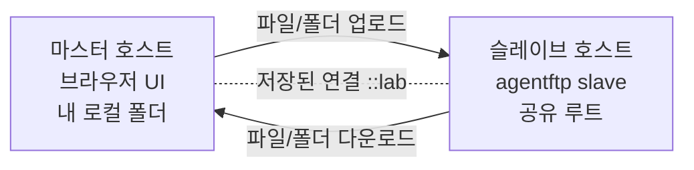
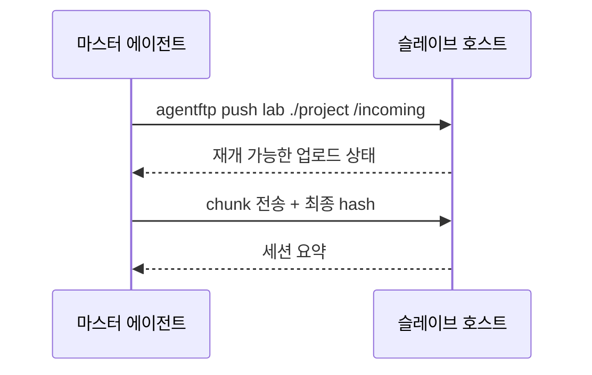
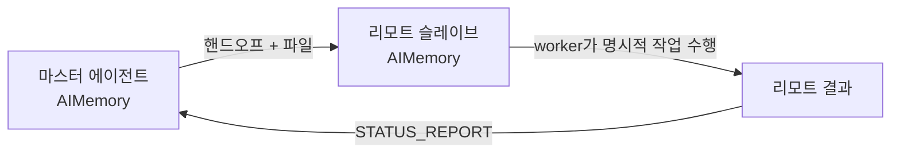
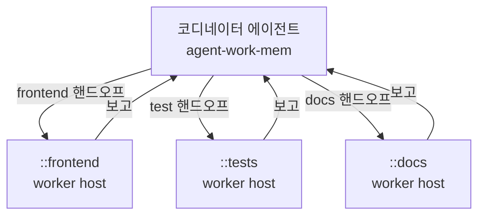

# agentFTP

[English](README.md) | [한국어](README.ko.md)

[](https://github.com/daystar7777/agentFTP/actions/workflows/ci.yml)

쉬운 서버 간 파일/폴더 전송과 리모트 에이전트 핸드오프. 에이전트 스웜 워크플로우를 만들기 위한 기반 도구입니다.

agentFTP는 한쪽 머신에서 현재 프로젝트 폴더를 **슬레이브**로 열고, 다른 머신에서 **마스터**로 접속해 브라우저 UI 또는 헤드리스 CLI로 파일을 주고받게 해줍니다. 단순 파일 전송을 넘어서, 프로젝트 폴더와 작업 지시를 함께 보내고, 리모트 에이전트의 수행 결과를 다시 보고받는 흐름을 목표로 합니다.

이런 의미에서 agentFTP는 agent-work-mem의 네트워크 확장입니다. agent-work-mem이 로컬 프로젝트 안에서 에이전트의 기억과 핸드오프를 관리한다면, agentFTP는 그 기억과 소통을 로컬을 넘어 신뢰할 수 있는 원격 호스트까지 이어줍니다.

agentFTP는 FTP 프로토콜이 아닙니다. 에이전트 작업에 맞춘 작은 HTTP/HTTPS API를 사용하며, 루트 폴더 제한, 대용량 파일 재개, sync 계획, agent-work-mem 기반 핸드오프 기록을 중심으로 설계되어 있습니다.

## 왜 agentFTP인가?

- **쉬운 사용법**: GitHub에서 설치하고 `bootstrap` 후 바로 슬레이브/마스터 모드 실행
- **강력한 파일 전송**: 브라우저 UI, 헤드리스 push/pull, 폴더 sync, 대용량 재개, 취소/재개, 충돌 검사, 디스크 여유 공간 사전 검사
- **리모트 에이전트 연동**: 파일과 지시를 함께 보내고, 리모트 worker가 명시적 작업을 수행한 뒤 보고 가능
- **에이전트 스웜 기반**: 저장된 호스트 이름, 호스트별 히스토리, 권한 스코프 토큰, worker 데몬, agent-work-mem 기반 로컬/리모트 AIMemory 기록
- **크로스 플랫폼**: Windows, macOS, Linux 지원 및 한글/악센트 파일명을 위한 Unicode 정규화 처리

## 두 가지 사용 모드

agentFTP는 유저가 직접 파일을 보고 옮기는 경우와, 에이전트가 GUI 없이 전송/핸드오프를 처리하는 경우를 모두 지원합니다.

에이전트 워크플로우에서는 `agentftp slave`, `agentftp master`, `agentftp worker`를 그냥 일반 터미널에서 직접 실행하기보다, 해당 프로젝트 폴더를 담당하는 에이전트에게 실행시키는 것을 권장합니다. 터미널에서 직접 실행해도 파일 전송은 동작하지만, 핸드오프와 AIMemory 기록이 어느 에이전트/프로젝트 컨텍스트에 속하는지 선명해지려면 에이전트가 자기 프로젝트 루트에서 agentFTP를 시작하는 흐름이 좋습니다.

### GUI 모드: 유저가 직접 전송

- 받는 쪽은 `agentftp slave`로 콘솔 슬레이브를 실행합니다.
- 보내는 쪽은 `agentftp master lab`로 브라우저 기반 마스터 UI를 엽니다.
- 마스터 브라우저는 자동으로 열리며, 왼쪽에는 리모트 파일, 오른쪽에는 로컬 파일을 보여줍니다.
- 브라우저를 자동으로 열지 않고 UI URL만 보고 싶으면 `agentftp master lab --no-browser`를 사용합니다.

GUI 모드는 유저가 양쪽 폴더를 직접 확인하고, 파일/폴더를 선택하고, 업로드/다운로드와 충돌 확인을 눈으로 처리하고 싶을 때 적합합니다.

### 헤드리스 모드: 에이전트가 직접 전송/핸드오프

- `agentftp push`, `agentftp pull`, `agentftp sync`로 파일과 폴더를 전송합니다.
- `agentftp tell`로 지시만 보내거나, `agentftp handoff`로 파일과 지시를 함께 보냅니다.
- 받는 쪽 에이전트는 `agentftp worker`로 처리 가능한 작업을 수행합니다.
- 결과는 `agentftp report`로 구조화된 보고로 돌려보냅니다.

헤드리스 모드는 자동화 경로입니다. 에이전트가 브라우저를 열지 않고 프로젝트 폴더를 옮기고, 리모트 작업을 지시하고, 수행 결과를 다시 보고받는 흐름에 적합합니다.

**중요:** 슬레이브 자체는 콘솔 프로세스입니다. 리모트 worker나 에이전트 런타임이 권한 확인/승인 프롬프트 모드로 실행되면, 슬레이브 호스트에서 누군가 직접 승인할 때까지 실행이 멈출 수 있습니다. 완전 자동 핸드오프를 원한다면 신뢰된 호스트, 명시적인 `agentftp-run:` 명령, 제한된 token scope, 좁은 프로젝트 루트와 함께 사전 승인된 worker 정책을 사용해야 합니다.

처음 실행 시 어떤 확인사항이 뜨는지는 [docs/agent-pairing.md](docs/agent-pairing.md)에 정리되어 있습니다.

## 현재 상태

agentFTP는 초기 `v0.1` 프로토타입입니다. 핵심 전송과 핸드오프 흐름은 구현되어 있고 시나리오 테스트로 고정되어 있지만, 아직 빠르게 발전 중인 프로젝트입니다. 민감한 프로젝트 데이터를 다룰 때는 신뢰할 수 있는 네트워크나 HTTPS를 사용하고, 보안 문서를 먼저 확인하세요.

v1 방향은 [docs/development-plan.md](docs/development-plan.md)에 정리되어 있습니다.

## 필수 전제: agent-work-mem

agentFTP는 각 프로젝트 루트에 [`agent-work-mem`](https://github.com/daystar7777/agent-work-mem)이 설치되어 있어야 동작합니다.

agent-work-mem은 `AIMemory/`를 통해 에이전트에게 로컬 작업 기억을 제공합니다. agentFTP는 이 기억 모델을 호스트 간으로 확장합니다. 보내는 핸드오프는 로컬에 기록되고, 받는 핸드오프는 리모트에 기록되며, 결과 보고도 다시 구조화된 기억으로 돌아올 수 있습니다.

`agentftp bootstrap`은 agent-work-mem 설치 여부를 확인합니다. 없다면 먼저 설치할지 물어보고, 사용자가 거절하면 agentFTP는 기억과 핸드오프 기록 없이 실행하지 않도록 의도적으로 중단합니다.

## 설치

```powershell
pipx install git+https://github.com/daystar7777/agentFTP.git
agentftp bootstrap
```

`bootstrap`은 Python, pip, Git, pipx, GitHub 연결성, agent-work-mem AIMemory를 확인합니다. agent-work-mem이 없으면 설치할지 물어보고, 거절하면 agentFTP 런타임 설치는 실패하도록 되어 있습니다.

로컬 개발 설치:

```powershell
git clone https://github.com/daystar7777/agentFTP.git
cd agentFTP
python -m pip install -e .
agentftp doctor
```

## 빠른 시작

파일을 받을 머신에서 해당 프로젝트를 담당하는 에이전트에게 공유할 폴더에서 슬레이브 모드를 실행하게 합니다.

```powershell
cd my-project
agentftp bootstrap
agentftp slave
```

처음 실행할 때 agent-work-mem 설치 여부, 페어링 비밀번호, 방화벽 개방 여부를 물을 수 있습니다. 이는 오류가 아니라 정상적인 페어링/설정 확인 단계입니다. 이후 슬레이브는 로컬/LAN/Tailscale 주소를 출력합니다. 기본 포트는 `7171`이고, 현재 폴더가 루트가 됩니다. 마스터는 이 루트 바깥을 탐색할 수 없습니다.

파일을 보낼 머신에서는 로컬 에이전트에게 연결 이름을 저장하고 브라우저 마스터 UI를 열게 합니다.

```powershell
cd my-project
agentftp bootstrap
agentftp connect lab 100.64.1.20
agentftp master lab
```

브라우저가 자동으로 열립니다. 왼쪽은 상대방 슬레이브 폴더, 오른쪽은 내 로컬 폴더입니다. 파일이나 폴더를 선택해서 양방향으로 전송할 수 있습니다.

## 사용 예제

### 1. 브라우저로 파일/폴더 전송

사람이 양쪽 폴더를 직접 보면서 파일이나 폴더를 옮기고 싶을 때 사용합니다.



```powershell
# 슬레이브 호스트
cd project-to-share
agentftp bootstrap
agentftp slave

# 마스터 호스트
cd my-project
agentftp bootstrap
agentftp connect lab 100.64.1.20
agentftp master lab
```

### 2. 헤드리스 프로젝트 전송

브라우저를 열지 않고 에이전트나 스크립트가 폴더를 전송해야 할 때 사용합니다.



```powershell
agentftp push lab ./project /incoming
agentftp pull lab /result ./received
```

### 3. 리모트 에이전트 핸드오프와 보고

상대 호스트에 파일과 작업 의도를 함께 보내고, 수행 결과를 구조화된 보고로 돌려받고 싶을 때 사용합니다.



```powershell
# 프로젝트와 지시를 함께 전송
agentftp handoff lab ./project "이 프로젝트를 리뷰하고 테스트 결과를 보고해줘." --expect-report "요약과 다음 단계"

# 리모트 호스트에서 수행
agentftp worker --execute ask

# 또는 수동 보고 전송
agentftp report master <handoff-id> "테스트 통과. 다음 단계는 릴리즈 준비."
```

### 4. 에이전트 스웜 기반 흐름

하나의 코디네이터가 여러 신뢰된 호스트에 서로 다른 폴더나 작업을 나눠 보내는 패턴입니다.



```powershell
agentftp connect frontend 100.64.1.21
agentftp connect tests 100.64.1.22
agentftp connect docs 100.64.1.23

agentftp handoff frontend ./web "UI 변경사항을 리뷰하고 위험요소를 보고해줘." --expect-report "리뷰 결과"
agentftp handoff tests ./project "테스트를 실행하고 실패를 보고해줘." --expect-report "테스트 결과"
agentftp tell docs "README를 리뷰하고 더 쉬운 예제를 제안해줘." --expect-report "문서 제안"
```

## HTTPS

호스트 간 전송에서는 HTTPS 사용을 권장합니다.

```powershell
agentftp slave --tls self-signed
```

슬레이브가 HTTPS URL과 SHA-256 fingerprint를 출력합니다. 마스터에서 연결할 때 이 fingerprint를 고정합니다.

```powershell
agentftp connect lab https://100.64.1.20:7171 --tls-fingerprint <sha256-fingerprint>
```

저장된 연결 이름은 이후 `master`, `push`, `pull`, `sync`, `tell`, `handoff`, `report`에서 같은 인증 정보를 재사용합니다.

## 헤드리스 파일 전송

파일 또는 폴더 업로드:

```powershell
agentftp push lab ./project /incoming
```

리모트에서 다운로드:

```powershell
agentftp pull lab /result ./received
```

보수적인 폴더 sync 계획/실행:

```powershell
agentftp sync plan lab ./project /project
agentftp sync push lab ./project /project --compare-hash
agentftp sync pull lab /project ./project
```

sync는 없는 파일을 복사하고, 대상에 변경된 파일이 있으면 충돌로 처리합니다. `--overwrite`가 없으면 덮어쓰지 않습니다. 대상에만 있는 파일은 삭제 후보로 보고하며, `--delete`를 명시했을 때만 삭제합니다.

## 리모트 에이전트 핸드오프

파일과 작업 지시를 함께 보냅니다.

```powershell
agentftp handoff lab ./project "이 프로젝트를 리뷰하고 테스트 결과를 보고해줘." --expect-report "요약과 다음 단계"
```

지시만 보낼 수도 있습니다.

```powershell
agentftp tell lab "/incoming/project를 리뷰하고 보고해줘." --path /incoming/project
```

받은 작업을 확인하고 보고합니다.

```powershell
agentftp inbox
agentftp inbox --read <instruction-id>
agentftp report lab <handoff-id> "테스트 통과."
```

리모트 worker 실행:

```powershell
agentftp worker --once
agentftp worker --execute ask
```

worker는 `agentftp-run: <command>`로 명시된 명령만 실행합니다. 그리고 `--execute ask` 또는 `--execute yes`가 있어야 실제 실행합니다. `--once`를 빼면 `autoRun` 핸드오프를 계속 폴링하는 데몬 모드로 동작합니다.

`--execute ask`를 사용할 경우 승인 프롬프트는 마스터가 아니라 슬레이브/worker 호스트의 콘솔에 표시됩니다. 수동 감독에는 안전하지만, 그 콘솔을 보고 있는 사람이 없다면 리모트 핸드오프가 무기한 대기할 수 있습니다.

## 저장된 호스트 이름

```powershell
agentftp connect lab 100.64.1.20
agentftp connections
agentftp disconnect lab
```

agentFTP는 저장된 연결 이름에 내부적으로 `::lab`처럼 `::` 접두사를 붙여 일반 단어와 구분합니다. 명령에서는 `lab`처럼 짧게 입력해도 됩니다.

호스트별 활동은 `AIMemory/agentftp_hosts/<name>.md`에 기록됩니다. 자세한 파일 전송 로그는 AIMemory가 아니라 `.agentftp/` 아래에 저장됩니다.

## 보안 모델

agentFTP는 보수적인 기본값을 사용합니다.

- 모든 파일 작업은 선택한 루트 폴더 안으로 제한
- 삭제는 즉시 삭제이며 명시적 사용자 동작 필요
- bearer token은 `read`, `write`, `delete`, `handoff` 스코프로 제한 가능
- 로그인과 요청은 rate limit 적용
- JSON body와 전송 chunk 크기 제한
- self-signed/manual HTTPS 지원
- 방화벽 열기는 `--firewall ask|yes|no`로 opt-in

읽기와 핸드오프만 가능한 연결 예시:

```powershell
agentftp connect reviewer 100.64.1.20 --scopes read,handoff
```

자세한 내용은 [docs/security.md](docs/security.md)를 보세요.

## 전송 상태와 로그

고용량 전송 세부 로그는 AIMemory에 직접 넣지 않습니다.

```text
.agentftp/
  logs/
  sessions/
  plans/
.agentftp_partial/
```

전송은 재개 가능하며, 로그는 크기 기준으로 로테이트됩니다. 취소되거나 중단된 전송은 나중에 이어받을 수 있도록 partial 파일을 남깁니다. 오래된 partial은 다음 명령으로 정리합니다.

```powershell
agentftp cleanup --older-than-hours 24
```

자세한 내용은 [docs/transfer-state.md](docs/transfer-state.md)를 보세요.

## 문서

- [사용 시나리오](docs/usage-scenarios.md)
- [에이전트 페어링](docs/agent-pairing.md)
- [헤드리스 핸드오프](docs/headless-handoff.md)
- [보안](docs/security.md)
- [프로토콜](docs/protocol.md)
- [전송 상태](docs/transfer-state.md)
- [파일명 정규화](docs/filename-normalization.md)
- [부트스트랩](docs/bootstrap.md)

## 개발

테스트 실행:

```powershell
$env:PYTHONPATH='src'
python -m unittest discover -s tests
```

현재 시나리오 테스트는 설치/부트스트랩, 슬레이브/마스터 전송, 헤드리스 push/pull, 핸드오프/보고 왕복, TLS, scoped token, sync, 디스크 여유 공간 사전 검사, 취소, cleanup, worker daemon 동작을 포함합니다.

## 라이선스

MIT
