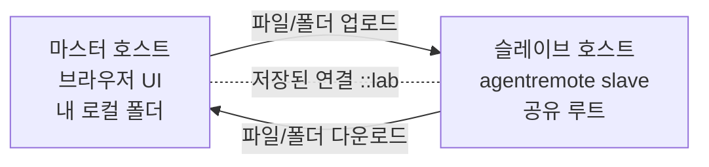
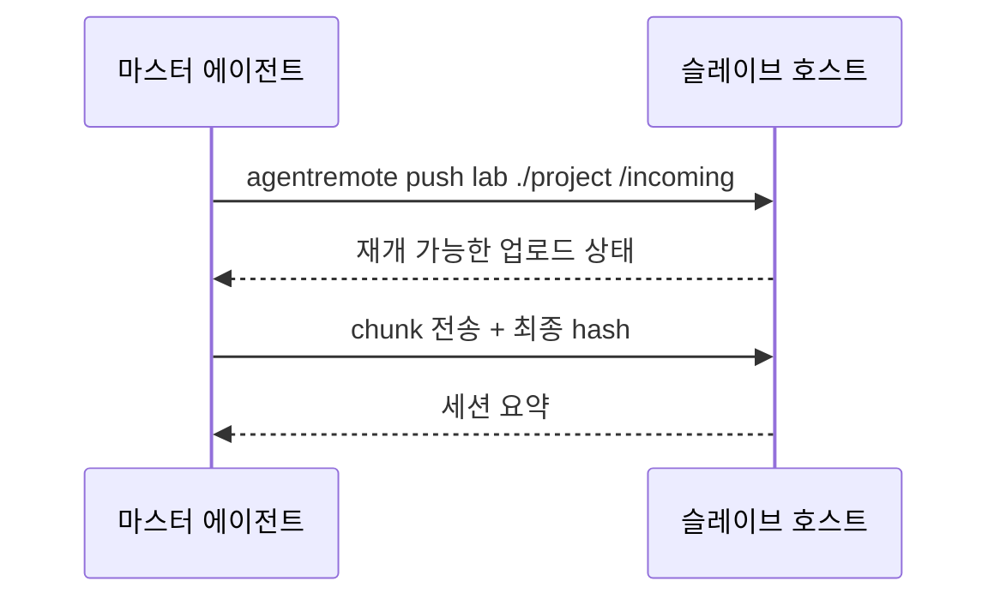
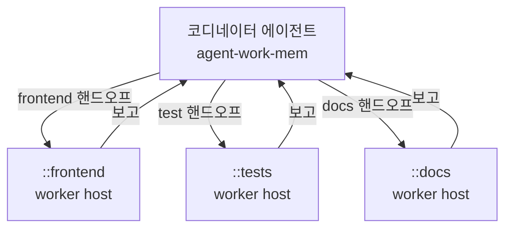

# agent-remote-sync

> 서버 간 파일/폴더 전송과 리모트 에이전트 핸드오프를 위한 에이전트 스웜 기반 도구입니다.
> `agentremote` CLI, Python import path, 배포 패키지명은 v0.1 인터페이스입니다.

[English](README.md) | [한국어](README.ko.md)

[](https://github.com/daystar7777/agent-remote-sync/actions/workflows/ci.yml)

쉬운 서버 간 파일/폴더 전송과 리모트 에이전트 핸드오프. 에이전트 스웜 워크플로우를 만들기 위한 기반 도구입니다.

agent-remote-sync는 한쪽 머신에서 현재 프로젝트 폴더를 **슬레이브**로 열고, 다른 머신에서 **마스터**로 접속해 브라우저 UI 또는 헤드리스 CLI로 파일을 주고받게 해줍니다. 단순 파일 전송을 넘어서, 프로젝트 폴더와 작업 지시를 함께 보내고, 리모트 에이전트의 수행 결과를 다시 보고받는 흐름을 목표로 합니다.

이런 의미에서 agent-remote-sync는 agent-work-mem의 네트워크 확장입니다. agent-work-mem이 로컬 프로젝트 안에서 에이전트의 기억과 핸드오프를 관리한다면, agent-remote-sync는 그 기억과 소통을 로컬을 넘어 신뢰할 수 있는 원격 호스트까지 이어줍니다.

agent-remote-sync는 FTP 프로토콜이 아닙니다. 에이전트 작업에 맞춘 작은 HTTP/HTTPS API를 사용하며, 루트 폴더 제한, 대용량 파일 재개, sync 계획, agent-work-mem 기반 핸드오프 기록을 중심으로 설계되어 있습니다.

## 왜 agent-remote-sync인가?

- **쉬운 사용법**: GitHub에서 설치하고 `bootstrap` 후 바로 슬레이브/마스터 모드 실행
- **강력한 파일 전송**: 브라우저 UI, 헤드리스 push/pull, 폴더 sync, 대용량 재개, 취소/재개, 충돌 검사, 디스크 여유 공간 사전 검사
- **리모트 에이전트 연동**: 파일과 지시를 함께 보내고, 리모트 worker가 명시적 작업을 수행한 뒤 보고 가능
- **에이전트 스웜 기반**: 저장된 호스트 이름, 호스트별 히스토리, 권한 스코프 토큰, worker 데몬, agent-work-mem 기반 로컬/리모트 AIMemory 기록
- **크로스 플랫폼**: Windows, macOS, Linux 지원 및 한글/악센트 파일명을 위한 Unicode 정규화 처리

## 두 가지 사용 모드

agent-remote-sync는 유저가 직접 파일을 보고 옮기는 경우와, 에이전트가 GUI 없이 전송/핸드오프를 처리하는 경우를 모두 지원합니다.

에이전트 워크플로우에서는 `agentremote slave`, `agentremote master`, `agentremote worker`를 그냥 일반 터미널에서 직접 실행하기보다, 해당 프로젝트 폴더를 담당하는 에이전트에게 실행시키는 것을 권장합니다. 터미널에서 직접 실행해도 파일 전송은 동작하지만, 핸드오프와 AIMemory 기록이 어느 에이전트/프로젝트 컨텍스트에 속하는지 선명해지려면 에이전트가 자기 프로젝트 루트에서 agent-remote-sync를 시작하는 흐름이 좋습니다.

### GUI 모드: 유저가 직접 전송

- 받는 쪽은 `agentremote slave`로 콘솔 슬레이브를 실행합니다.
- 보내는 쪽은 `agentremote master lab`로 브라우저 기반 마스터 UI를 엽니다.
- 마스터 브라우저는 자동으로 열리며, 왼쪽에는 리모트 파일, 오른쪽에는 로컬 파일을 보여줍니다.
- Windows에서 에이전트가 인터랙티브 터미널 없이 `slave`나 `master`를 실행하면, agent-remote-sync는 기본적으로 새 콘솔 창을 열어 나중에 상태를 확인하고 종료할 수 있게 합니다.
- 브라우저를 자동으로 열지 않고 UI URL만 보고 싶으면 `agentremote master lab --no-browser`를 사용합니다.
  현재 비대화형 세션 안에 그대로 두고 싶을 때만 `--console no`를 사용합니다.

GUI 모드는 유저가 양쪽 폴더를 직접 확인하고, 파일/폴더를 선택하고, 업로드/다운로드와 충돌 확인을 눈으로 처리하고 싶을 때 적합합니다.

### 헤드리스 모드: 에이전트가 직접 전송/핸드오프

- `agentremote push`, `agentremote pull`, `agentremote sync`로 파일과 폴더를 전송합니다.
- `agentremote tell`로 지시만 보내거나, `agentremote handoff`로 파일과 지시를 함께 보냅니다.
- 받는 쪽 에이전트는 `agentremote worker`로 처리 가능한 작업을 수행합니다.
- 결과는 `agentremote report`로 구조화된 보고로 돌려보냅니다.

헤드리스 모드는 자동화 경로입니다. 에이전트가 브라우저를 열지 않고 프로젝트 폴더를 옮기고, 리모트 작업을 지시하고, 수행 결과를 다시 보고받는 흐름에 적합합니다.

**중요:** 슬레이브 자체는 콘솔 프로세스입니다. 리모트 worker나 에이전트 런타임이 권한 확인/승인 프롬프트 모드로 실행되면, 슬레이브 호스트에서 누군가 직접 승인할 때까지 실행이 멈출 수 있습니다. 완전 자동 핸드오프를 원한다면 신뢰된 호스트, 명시적인 `agentremote-run:` 명령, 제한된 token scope, 좁은 프로젝트 루트와 함께 사전 승인된 worker 정책을 사용해야 합니다.

처음 실행 시 어떤 확인사항이 뜨는지는 [docs/agent-pairing.md](docs/agent-pairing.md)에 정리되어 있습니다.

### 스웜 명령어 프리뷰

기존 `agentremote slave`와 `agentremote master`는 계속 지원됩니다. 여기에
스웜/데몬/컨트롤러 방향의 Phase 0 명령어가 추가되었습니다.

```powershell
agentremote daemon serve        # 기존 slave 모드 호환 명령
agentremote controller gui lab  # 기존 master 브라우저 UI 호환 명령
agentremote daemon status
agentremote nodes list
agentremote topology show
agentremote policy list
agentremote policy allow lab --note "trusted worker"
agentremote policy allow-tailscale  # Tailscale IPv4/IPv6 대역 허용
agentremote route set lab 100.64.1.20 7171 --priority 10
agentremote route list
```

policy와 route 데이터는 비밀정보 없이 로컬 컨트롤러 쪽 메타데이터로
저장됩니다. 저장된 연결 alias는 직접 연결된 원격 노드로 표시되고,
명시적 route는 priority로 우선순위를 지정할 수 있습니다. 화이트리스트
강제 적용은 `--policy warn|strict|off`로 사용할 수 있습니다.
`policy allow-tailscale`은 Tailscale의 기본 IPv4/IPv6 tailnet 대역을 CIDR
화이트리스트로 등록하며, 비밀번호/토큰 인증은 그대로 필요합니다. 멀티홉
라우팅과 더 풍부한 지연시간 기반 라우팅 선택은 다음 단계에서 확장할 수 있습니다.

## 현재 상태

agent-remote-sync는 초기 `v0.1` 프로토타입입니다. 핵심 전송과 핸드오프 흐름은 구현되어 있고 시나리오 테스트로 고정되어 있지만, 아직 빠르게 발전 중인 프로젝트입니다. 민감한 프로젝트 데이터를 다룰 때는 신뢰할 수 있는 네트워크나 HTTPS를 사용하고, 보안 문서를 먼저 확인하세요.

v1 방향은 [docs/development-plan.md](docs/development-plan.md)에 정리되어 있습니다.

## 필수 전제: agent-work-mem

agent-remote-sync는 각 프로젝트 루트에 [`agent-work-mem`](https://github.com/daystar7777/agent-work-mem)이 설치되어 있어야 동작합니다.

agent-work-mem은 `AIMemory/`를 통해 에이전트에게 로컬 작업 기억을 제공합니다. agent-remote-sync는 이 기억 모델을 호스트 간으로 확장합니다. 보내는 핸드오프는 로컬에 기록되고, 받는 핸드오프는 리모트에 기록되며, 결과 보고도 다시 구조화된 기억으로 돌아올 수 있습니다.

`agentremote bootstrap`은 agent-work-mem 설치 여부를 확인합니다. 없다면 먼저 설치할지 물어보고, 사용자가 거절하면 agent-remote-sync는 기억과 핸드오프 기록 없이 실행하지 않도록 의도적으로 중단합니다.

## 설치

```powershell
pipx install git+https://github.com/daystar7777/agent-remote-sync.git
agentremote setup
```

`setup`은 `bootstrap`의 쉬운 별칭입니다. Python, pip, Git, pipx, GitHub 연결성, agent-work-mem AIMemory를 확인합니다. agent-work-mem이 없으면 설치할지 물어보고, 거절하면 agent-remote-sync 런타임 설치는 실패하도록 되어 있습니다.

로컬 개발 설치:

```powershell
git clone https://github.com/daystar7777/agent-remote-sync.git
cd agent-remote-sync
python -m pip install -e .
agentremote doctor
```

명령이 예전 코드로 실행되는 것처럼 보이면 `agentremote doctor --root <project>`를
먼저 확인하세요. 실행 파일 경로, import 중인 패키지 경로, 감지된 checkout,
AIMemory 상태, 등록된 로컬 프로세스를 보여줍니다. import 중인 checkout이
의도한 저장소와 다르면 오래된 agentremote 프로세스를 종료한 뒤, 원하는 저장소에서
`python -m pip install -e .`를 다시 실행하세요.

설치 후 LLM이 바로 참고할 수 있는 명령 가이드는 다음으로 출력할 수 있습니다.

```powershell
agentremote onboarding --ko
```

## 빠른 시작

사람과 에이전트가 먼저 쓰는 쉬운 명령 표면은 다음과 같습니다.

```powershell
agentremote setup
agentremote share
agentremote connect lab 100.64.1.20
agentremote open lab
agentremote send lab ./KKK
agentremote sync-project lab
agentremote ask lab "테스트 실행하고 보고해줘" --wait-report
agentremote handoff lab ./LLL "검토하고 보고해줘"
agentremote map
agentremote status
agentremote doctor
agentremote uninstall
```

### 매일 쓰는 흐름

처음 설정이 끝난 뒤에는 자주 쓰는 흐름이 짧아야 합니다.

```powershell
agentremote share --host 0.0.0.0
agentremote daemon profile save --root . --name current-project --host 0.0.0.0 --port 7171
agentremote connect lab 100.64.1.20
agentremote open lab
agentremote sync-project lab --yes
agentremote ask lab "테스트 실행하고 보고해줘" --wait-report
agentremote map
agentremote status
agentremote processes
```

노드, 저장된 데몬 프로필, 로컬 프로세스, 최근 콜, 승인 대기를 한 화면에서
보고 싶으면 브라우저 대시보드를 사용합니다.

파일을 받을 머신에서 해당 프로젝트를 담당하는 에이전트에게 공유할 폴더에서 실행하게 합니다.

```powershell
cd my-project
agentremote setup
agentremote share
```

처음 실행할 때 agent-work-mem 설치 여부, 페어링 비밀번호, 방화벽 개방 여부를 물을 수 있습니다. 이는 오류가 아니라 정상적인 페어링/설정 확인 단계입니다. `agentremote share`는 안전한 로컬 테스트를 위해 기본적으로 `127.0.0.1`에만 바인딩합니다. 신뢰된 LAN/Tailscale에서 원격 접속을 받으려면 다음처럼 실행합니다.

```powershell
agentremote share --host 0.0.0.0
```

Windows에서 에이전트가 실행했다면 agent-remote-sync가 새 콘솔 창을 자동으로 여는 것이 기본 동작입니다. 이후 share는 실제 바인딩 방식에 맞는 주소만 출력합니다. 기본 포트는 `7171`이고, 현재 폴더가 루트가 됩니다. 컨트롤러는 이 루트 바깥을 탐색할 수 없습니다.

파일을 보낼 머신에서는 로컬 에이전트에게 연결 이름을 저장하고 브라우저 마스터 UI를 열게 합니다.

```powershell
cd my-project
agentremote setup
agentremote connect lab 100.64.1.20
agentremote open lab
```

브라우저가 자동으로 열립니다. 왼쪽은 상대방 슬레이브 폴더, 오른쪽은 내 로컬 폴더입니다. 파일이나 폴더를 선택해서 양방향으로 전송할 수 있습니다.

기존 고급 호환 명령도 그대로 사용할 수 있습니다: `agentremote slave`,
`agentremote master`, `agentremote push`, `agentremote pull`, `agentremote sync`,
`agentremote topology`.

### 맵과 상태 확인

명령을 보내기 전에 현재 연결 구조를 빠르게 보고 싶으면 `agentremote map`을
사용합니다. 알려진 노드, 선택된 라우트, 최신 콜 상태, 대기 중인 승인,
명시적인 whitelist 상태를 한 줄씩 보여줍니다.

```powershell
agentremote map
```

현재 프로젝트의 로컬 상태를 요약하려면 `agentremote status`를 사용합니다.
AIMemory 설치 여부, 저장된 연결 수, 노드 상태 카운트, 로컬
마스터/슬레이브/워커 프로세스, 콜 결과, 승인 대기 건수를 보여줍니다.

```powershell
agentremote status
```

브라우저 대시보드도 같은 구조의 정보를 카드와 목록으로 보여줍니다. 노드,
프로세스 제어, 최근 콜, 승인 대기 카드를 한 화면에서 볼 수 있으며,
보안을 위해 승인 세부내용, 토큰 hash, 저장된 연결 토큰은 대시보드
payload에 노출하지 않습니다.

### 프로세스와 GUI 관리

`agentremote processes`는 현재 프로젝트에 등록된 로컬 slave/master/worker 또는
controller GUI 프로세스를 보여줍니다. `7180` 같은 GUI 포트가 오래된 세션에
잡혀 있을 때 어느 프로세스가 살아 있는지 확인하는 용도로도 유용합니다.

```powershell
agentremote processes
agentremote processes --root C:\work\VTubes
agentremote processes stop <process-id>
agentremote processes stop-gui
agentremote stop-gui --root C:\work\VTubes
agentremote processes forget <process-id>
```

`stop`과 `stop-gui`는 레지스트리 메타데이터가 현재 프로젝트 루트/PID fingerprint와
맞지 않으면 프로세스를 종료하지 않습니다. `forget`은 오래된 레지스트리 항목만
지우며, 실제 프로세스를 종료하지 않습니다.

### 데몬 프로필

반복해서 사용할 프로젝트는 데몬 프로필로 저장해둘 수 있습니다. 프로필에는
프로젝트 루트, 바인딩 host, port, 표시 이름만 저장됩니다. 페어링 비밀번호는
저장하지 않습니다.

```powershell
agentremote daemon profile save --root . --name current-project --host 127.0.0.1 --port 7171
agentremote daemon profile list --root .
agentremote daemon status --root .
agentremote daemon install --root .
agentremote daemon uninstall --root .
```

v0.1에서 `install`과 `uninstall`은 dry-run 계획 명령입니다. Windows Task
Scheduler, macOS LaunchAgent, Linux `systemd --user` 형태를 보여주지만 OS를
직접 변경하지는 않습니다. 생성되는 서비스 명령은
`--password-env AGENTREMOTE_DAEMON_PASSWORD`를 사용하므로 비밀값이 프로필 파일이나
명령줄에 직접 저장되지 않습니다.

### 안전한 제거

제거는 의도적으로 명시적인 dry-run에서 시작합니다.

```powershell
agentremote uninstall --root . --project-state
agentremote daemon profile list --root .
agentremote daemon profile remove --root . --name current-project
agentremote daemon uninstall --root .
```

`agentremote uninstall`은 기본적으로 AIMemory를 삭제하지 않습니다. 프로젝트의
핸드오프/작업 이력을 보존하려면 AIMemory를 그대로 두세요. `--purge-memory`는
무엇이 지워질지 검토한 뒤에만 사용합니다.

### 프로젝트 싱크 기본값

`agentremote sync-project lab`은 기본적으로 plan-first입니다. 먼저 싱크 계획을
작성하고 파일 수, 전송 용량, 충돌, 제외 항목, 리모트 여유 공간을 표시합니다.
`--yes`를 붙이기 전까지는 실제 전송하지 않습니다.

```powershell
agentremote sync-project lab
agentremote sync-project lab --yes
agentremote sync-project lab --local ./subproject /remote/subproject --yes
agentremote sync-project lab /Project --include-memory --profile unity-python-llm
agentremote sync-project lab /Project --include-memory --profile unity-python-llm --yes
agentremote sync-project lab /Project --all-files --dry-run
agentremote sync-project lab /Project --all-files --exclude node_modules --yes
```

기본 `standard` profile은 헤드리스 프로젝트 핸드오프를 안전하게 하기 위한
보수적 기본값입니다. 업로드 전에 흔한 생성물, 로컬 에이전트 상태, 비밀 파일
패턴을 제외합니다. 예를 들어 `.git/`, `.venv/`, `venv/`, `node_modules/`,
Python 캐시, `dist/`, `build/`, Unity 계열 `Library/`, `Temp/`, `Obj/`,
`Logs/`, `UserSettings/`, 로컬 에이전트 폴더 `.claude/`, `.codex/`,
`.opencode/`, 그리고 `.env`, `.env.*`, `*.pem`, `*.key`, `*.p12`, `*.pfx`,
`*.crt` 같은 비밀 파일 패턴이 제외됩니다.

사용 가능한 sync profile:

- `standard`: 혼합 프로젝트를 위한 기본 안전 profile
- `unity`: Unity 생성 폴더 `Library/`, `Logs/`, `Temp/`, `Obj/`, `UserSettings/`
- `python`: Python virtualenv/cache/build 폴더
- `node`: `node_modules/`, `.next/`, `coverage/` 같은 Node/frontend 생성물
- `llm`: `models/`, `tts/`, `audio_out/`, `*.gguf` 같은 대형 모델/런타임 출력
- `unity-python-llm`: Unity/Python/Node/LLM이 섞인 워크스페이스용 조합 profile

`AIMemory/`는 `--include-memory`를 줄 때만 포함됩니다. 다만
`--include-memory`를 써도 로컬 런타임 성격의 volatile memory는 기본 제외됩니다:
`AIMemory/agentremote_hosts/`, `AIMemory/swarm/calls/`,
`AIMemory/swarm/events/`, `AIMemory/swarm/nodes/`, `AIMemory/swarm/routes.md`.
로컬 연결/토폴로지 런타임 상태까지 정말 옮기고 싶을 때만
`--include-volatile-memory`를 사용하세요.

`AIMemory/work.log`는 기본 로그 제외 규칙에 걸리지 않습니다. `logs/`, `Logs/`
같은 런타임 로그 디렉터리는 제외하지만, `--include-memory`를 쓰면 프로젝트
작업 기억 로그는 함께 이동할 수 있습니다.

사용자가 명시적으로 “전부 올리기”를 원하면 `--all-files` 또는
`--no-default-excludes`를 사용합니다. 이 옵션은 기본/profile/volatile 제외를
끄고 사용자가 직접 준 `--exclude`만 적용합니다. 단, partial upload 디렉터리처럼
agentremote 프로토콜 내부 예약 상태는 전송 계층에서 계속 보호됩니다.

대량 파일 sync는 transfer endpoint backoff와 더 높은 authenticated bulk-transfer
rate limit을 사용합니다. `.gitkeep`, 빈 `__init__.py`, 빈 `.jsonl` 같은 0바이트
파일도 지원합니다. 이 수정에 의존하려면 리모트 slave/daemon도 새 버전으로
업데이트하고 재시작해야 합니다. 오래된 리모트 서버는 여전히 0바이트 업로드에서
실패할 수 있습니다.

## 사용 예제

### 1. 브라우저로 파일/폴더 전송

사람이 양쪽 폴더를 직접 보면서 파일이나 폴더를 옮기고 싶을 때 사용합니다.



```powershell
# 슬레이브 호스트
cd project-to-share
agentremote bootstrap
agentremote slave

# 마스터 호스트
cd my-project
agentremote bootstrap
agentremote connect lab 100.64.1.20
agentremote master lab
```

### 2. 헤드리스 프로젝트 전송

브라우저를 열지 않고 에이전트나 스크립트가 폴더를 전송해야 할 때 사용합니다.



```powershell
agentremote push lab ./project /incoming
agentremote pull lab /result ./received
```

### 3. 리모트 에이전트 핸드오프와 보고

상대 호스트에 파일과 작업 의도를 함께 보내고, 수행 결과를 구조화된 보고로 돌려받고 싶을 때 사용합니다.


```powershell
# 프로젝트와 지시를 함께 전송
agentremote handoff lab ./project "이 프로젝트를 리뷰하고 테스트 결과를 보고해줘." --expect-report "요약과 다음 단계"

# 리모트 호스트에서 수행
agentremote worker --execute ask

# 또는 수동 보고 전송
agentremote report master <handoff-id> "테스트 통과. 다음 단계는 릴리즈 준비."
```

`--wait-report`는 현재 프로젝트로 되돌아오는 보고를 기다리는 기능일 뿐, 원격
LLM을 마법처럼 깨우는 기능은 아닙니다. 현재 버전의 slave/daemon은 embedded
auto-worker를 기본으로 켜고 시작 시 처리되지 않은 `autoRun` inbox 항목을 먼저
처리합니다. 순수 수동 inbox 모드가 필요하면 `--no-auto-worker`를 사용하세요.
자연어 작업은 받는 쪽에 `--worker-agent-command`가 설정되어 있어야 실제 해결까지
진행됩니다. 그렇지 않으면 worker는 명시적 `agentremote-run:` 명령만 실행하거나
blocker를 보고할 수 있습니다. 대기가 timeout되면
`agentremote calls show <call-id> --root <project>`와
`agentremote calls wait <call-id> --root <project>`로 상태를 확인하거나 다시 기다리세요.

### 4. 에이전트 스웜 기반 흐름

하나의 코디네이터가 여러 신뢰된 호스트에 서로 다른 폴더나 작업을 나눠 보내는 패턴입니다.



```powershell
agentremote connect frontend 100.64.1.21
agentremote connect tests 100.64.1.22
agentremote connect docs 100.64.1.23

agentremote handoff frontend ./web "UI 변경사항을 리뷰하고 위험요소를 보고해줘." --expect-report "리뷰 결과"
agentremote handoff tests ./project "테스트를 실행하고 실패를 보고해줘." --expect-report "테스트 결과"
agentremote tell docs "README를 리뷰하고 더 쉬운 예제를 제안해줘." --expect-report "문서 제안"
```

## HTTPS

호스트 간 전송에서는 HTTPS 사용을 권장합니다.

```powershell
agentremote slave --tls self-signed
```

슬레이브가 HTTPS URL과 SHA-256 fingerprint를 출력합니다. 마스터에서 연결할 때 이 fingerprint를 고정합니다.

```powershell
agentremote connect lab https://100.64.1.20:7171 --tls-fingerprint <sha256-fingerprint>
```

저장된 연결 이름은 이후 `master`, `push`, `pull`, `sync`, `tell`, `handoff`, `report`에서 같은 인증 정보를 재사용합니다.

## 헤드리스 파일 전송

파일 또는 폴더 업로드:

```powershell
agentremote push lab ./project /incoming
```

리모트에서 다운로드:

```powershell
agentremote pull lab /result ./received
```

보수적인 폴더 sync 계획/실행:

```powershell
agentremote sync plan lab ./project /project
agentremote sync push lab ./project /project --compare-hash
agentremote sync pull lab /project ./project
```

sync는 없는 파일을 복사하고, 대상에 변경된 파일이 있으면 충돌로 처리합니다. `--overwrite`가 없으면 덮어쓰지 않습니다. 대상에만 있는 파일은 삭제 후보로 보고하며, `--delete`를 명시했을 때만 삭제합니다.

## 리모트 에이전트 핸드오프

파일과 작업 지시를 함께 보냅니다.

```powershell
agentremote handoff lab ./project "이 프로젝트를 리뷰하고 테스트 결과를 보고해줘." --expect-report "요약과 다음 단계"
```

지시만 보낼 수도 있습니다.

```powershell
agentremote ask lab "/incoming/project를 리뷰하고 보고해줘." --path /incoming/project --wait-report
agentremote tell lab "/incoming/project를 리뷰하고 보고해줘." --path /incoming/project
agentremote tell lab "이건 수동 검토 inbox에만 남겨줘." --no-auto-run
```

`ask`는 지시만 보내는 쉬운 명령입니다. 기본적으로 보고를 요청하며,
`--wait-report --timeout 600`을 붙이면 매칭되는 `STATUS_REPORT`를 기다립니다.
`ask`, `tell`, `handoff`, `call`은 기본적으로 instruction을 `autoRun`으로 보냅니다.
받는 쪽 inbox에만 남겨두고 수동 검토하려면 `--no-auto-run`을 사용하세요.
파일과 지시를 함께 보낼 때는 기존 positional 형식과 명시적 형식을 모두 사용할 수 있습니다.

```powershell
agentremote handoff lab ./project "이 프로젝트를 리뷰하고 보고해줘."
agentremote handoff lab --path ./project --task "이 프로젝트를 리뷰하고 보고해줘." --wait-report
```

받은 작업을 확인하고 보고합니다.

```powershell
agentremote inbox
agentremote inbox --read <instruction-id>
agentremote report lab <handoff-id> "테스트 통과."
```

리모트 worker 실행:

```powershell
agentremote worker --once
agentremote worker --execute ask
agentremote worker --execute yes --agent-command "python ./agent_bridge.py"
agentremote daemon serve --root . --worker-agent-command "python ./agent_bridge.py"
agentremote daemon serve --root . --no-auto-worker
```

worker는 `agentremote-run: <command>`로 명시된 명령만 실행합니다. 그리고
`--execute ask` 또는 `--execute yes`가 있어야 실제 실행합니다. slave/daemon은
기본적으로 embedded worker를 `--worker-execute yes`로 함께 시작하므로, 받는 쪽을
켜면 쌓여 있던 `autoRun` 메시지를 먼저 처리합니다. 받기만 하고 수동 검토하려면
`--no-auto-worker`를 사용하세요. standalone `agentremote worker`에서 `--once`를
빼면 `autoRun` 핸드오프를 계속 폴링합니다.

`agentremote-run:`이 없는 자연어 핸드오프를 자동 처리하려면 받는 쪽에 로컬
에이전트 브리지를 명시해야 합니다. 단발 worker에는 `--agent-command`, 계속
떠 있는 slave/daemon에는 `--worker-agent-command`를 사용합니다.
브리지 명령은 받는 쪽 호스트에서 실행되며 다음 환경변수를 받습니다.

- `AGENTREMOTE_BRIDGE_INPUT`: task, handoff id, expected report, 관련 경로가 담긴 JSON 요청 파일
- `AGENTREMOTE_BRIDGE_OUTPUT`: 브리지가 최종 보고서를 써야 하는 markdown 파일
- `AGENTREMOTE_ROOT`, `AGENTREMOTE_INSTRUCTION_ID`, `AGENTREMOTE_HANDOFF_ID`, `AGENTREMOTE_HANDOFF_FILE`

브리지가 `AGENTREMOTE_BRIDGE_OUTPUT` 파일을 쓰면 그 내용이 `STATUS_REPORT`가
되고, 파일이 비어 있으면 stdout이 보고로 사용됩니다. 이 기능은 원격 지시가
로컬 에이전트 명령을 구동하게 만드는 강한 기능이므로, 신뢰된 노드와 좁은
프로젝트 루트에서만 opt-in으로 사용하세요. worker-policy allowlist는
instruction 안에 들어온 `agentremote-run:` 명령에 적용됩니다. 브리지 명령은
운영자가 직접 설정한 명령이며 approval policy의 승인을 따릅니다.

실행하려면 받는 쪽 프로젝트에 로컬 worker command policy도 필요합니다. 좁은
allowlist에서 시작하는 것을 권장합니다.

```powershell
agentremote worker-policy init --root .
agentremote worker-policy allow python-tests python --args-pattern "*pytest*" --timeout 300 --max-stdout 20000 --root .
agentremote worker-policy templates --root .
agentremote worker-policy apply-template python-compile --root .
agentremote worker-policy list --root .
```

`worker-policy` 규칙에 맞지 않는 명령은 `autoRun`이고 worker가 `--execute yes`로
실행되어도 `blocked`로 처리되며 실제로 실행되지 않습니다. worker policy 규칙은
기본적으로 시스템 shell 없이 실행됩니다. shell builtin이나 shell expansion이 꼭
필요한 명령만 `--shell`로 명시하세요.

v0.1에서 worker-policy의 `network`, `cwdPattern`, `envAllowlist` 필드는 설명용
metadata입니다. 의도를 기록하고 향후 강제 기능을 준비하기 위한 값이며, 현재
명령의 네트워크/파일시스템/환경 접근을 sandbox처럼 제한하지는 않습니다.

`--execute ask`를 사용할 경우 승인 프롬프트는 마스터가 아니라 슬레이브/worker 호스트의 콘솔에 표시됩니다. 수동 감독에는 안전하지만, 그 콘솔을 보고 있는 사람이 없다면 리모트 핸드오프가 무기한 대기할 수 있습니다.

## 저장된 호스트 이름

```powershell
agentremote connect lab 100.64.1.20
agentremote connections
agentremote disconnect lab
```

agent-remote-sync는 저장된 연결 이름에 내부적으로 `::lab`처럼 `::` 접두사를 붙여 일반 단어와 구분합니다. 명령에서는 `lab`처럼 짧게 입력해도 됩니다.

호스트별 활동은 `AIMemory/agentremote_hosts/<name>.md`에 기록됩니다. 자세한 파일 전송 로그는 AIMemory가 아니라 `.agentremote/` 아래에 저장됩니다.

## 보안 모델

agent-remote-sync는 보수적인 기본값을 사용합니다.

- 모든 파일 작업은 선택한 루트 폴더 안으로 제한
- 삭제는 즉시 삭제이며 명시적 사용자 동작 필요
- bearer token은 `read`, `write`, `delete`, `handoff` 스코프로 제한 가능
- 로그인과 요청은 rate limit 적용
- JSON body와 전송 chunk 크기 제한
- self-signed/manual HTTPS 지원
- 방화벽 열기는 `--firewall ask|yes|no`로 opt-in

읽기와 핸드오프만 가능한 연결 예시:

```powershell
agentremote connect reviewer 100.64.1.20 --scopes read,handoff
```

자세한 내용은 [docs/security.md](docs/security.md)를 보세요.

## 승인 모드 (v0.1)

agent-remote-sync는 프로젝트 루트별로 민감한 작업 앞에 승인 게이트를 둘 수 있습니다.

```powershell
# 현재 정책 확인
agentremote approvals policy --root .

# 승인 모드 설정
agentremote approvals policy --root . --mode ask     # 위험 작업만 묻기
agentremote approvals policy --root . --mode strict   # 모든 쓰기/삭제 묻기
agentremote approvals policy --root . --mode deny     # 민감 작업 전부 거부
agentremote approvals policy --root . --mode auto     # 기본값, 승인 없이 진행
```

승인이 필요하면 요청이 생성됩니다. 마스터 대시보드는 대기 중인 승인 요청을
origin type/node, target node, risk level, summary와 함께 보여줍니다. CLI나
대시보드에서 승인/거부할 수 있습니다.

```powershell
agentremote approvals list --root .
agentremote approvals approve <id> --root .
agentremote approvals deny <id> --root .
```

게이트가 걸리는 작업에는 worker 명령 실행, 프로세스 stop/forget,
로컬/리모트 삭제, 정책 변경이 포함됩니다. 승인 기록은 `.agentremote/approvals`
아래에 저장되고 AIMemory에도 미러링되지만, 승인 토큰이나 secret이 섞일 수
있는 원문 detail은 기록하지 않습니다.

> **주의:** `ask`/`strict`/`deny` 모드는 다른 컨트롤러나 CLI가 승인할 때까지
> 헤드리스/worker 흐름을 멈출 수 있습니다. 호환성을 위해 기본값은 `auto`입니다.

## 전송 상태와 로그

고용량 전송 세부 로그는 AIMemory에 직접 넣지 않습니다.

```text
.agentremote/
  logs/
  sessions/
  plans/
.agentremote_partial/
```

전송은 재개 가능하며, 로그는 크기 기준으로 로테이트됩니다. 취소되거나 중단된 전송은 나중에 이어받을 수 있도록 partial 파일을 남깁니다. 오래된 partial은 다음 명령으로 정리합니다.

```powershell
agentremote cleanup --older-than-hours 24
```

자세한 내용은 [docs/transfer-state.md](docs/transfer-state.md)를 보세요.

## 문서

- [사용 시나리오](docs/usage-scenarios.md)
- [에이전트 페어링](docs/agent-pairing.md)
- [헤드리스 핸드오프](docs/headless-handoff.md)
- [보안](docs/security.md)
- [프로토콜](docs/protocol.md)
- [전송 상태](docs/transfer-state.md)
- [파일명 정규화](docs/filename-normalization.md)
- [부트스트랩](docs/bootstrap.md)

## 개발

테스트 실행:

```powershell
$env:PYTHONPATH='src'
python -m compileall -q src tests deepseek-test
python -m unittest discover -s tests
python -m pytest tests deepseek-test -q
```

현재 시나리오 테스트는 설치/부트스트랩, 슬레이브/마스터 전송, 헤드리스 push/pull, 핸드오프/보고 왕복, TLS, scoped token, sync, 디스크 여유 공간 사전 검사, 취소, cleanup, worker daemon 동작을 포함합니다.

## 릴리즈 스모크 체크리스트 (v0.1)

릴리즈 전에 다음 수동 흐름을 확인합니다.

```powershell
$env:PYTHONPATH='src'
python smoke.py
```

스모크 스크립트는 임시 디렉터리에서 로컬 daemon, 연결, push, handoff,
worker-policy, worker execution, approval-policy 확인을 실행합니다. Tailscale이나 외부 네트워크는
필요하지 않습니다.

```powershell
$env:PYTHONPATH='src'
New-Item -ItemType Directory -Force test-root | Out-Null

# 1. 부트스트랩
python -m agentremote bootstrap --root ./test-root --install yes --no-network-check

# 2. 데몬 실행
python -m agentremote daemon serve --root ./test-root --password test --port 17171

# 3. 다른 터미널에서 연결 저장
python -m agentremote connect lab 127.0.0.1 17171 --password test

# 4. 전송
echo "hello" > test.txt
python -m agentremote push lab test.txt /incoming

# 5. 핸드오프
python -m agentremote handoff lab test.txt "Review test.txt and report"

# 6. 승인 모드
python -m agentremote approvals policy --root . --mode ask
python -m agentremote approvals list --root .

# 7. 정리
python -m agentremote cleanup --root ./test-root
```

스모크 확인이 끝나면 데몬 터미널은 `Ctrl+C`로 종료합니다.

## 알려진 제한사항

- v0.1의 `agentremote daemon install`과 `agentremote daemon uninstall`은 dry-run 계획
  명령입니다. Windows Task Scheduler, macOS LaunchAgent, Linux `systemd --user`
  형식을 출력하지만 OS 서비스 생성/삭제를 직접 수행하지는 않습니다.
- 릴레이 페어링과 유료 모바일 컨트롤러는 future 기능으로 남겨두었습니다.
  현재는 LAN, VPN, Tailscale, 또는 직접 공개한 HTTPS 엔드포인트를 사용합니다.
- 플러딩/DDoS 방어는 앱 내부의 rate limit, panic shutdown, whitelist로 피해를
  줄이는 구조입니다. 인터넷에 직접 노출할 때는 방화벽, VPN, reverse proxy,
  cloud edge 보호가 함께 필요합니다.
- worker policy의 `network`, `cwd`, `env` 필드는 v0.1에서 정책 메타데이터로
  기록됩니다. 명령 allow/deny와 timeout 제한은 동작합니다.
- swarm topology와 route health는 컨트롤러 측 조정 데이터입니다. 노드가
  꺼지거나 오프라인이면 로컬 프로세스 레지스트리와 route probe가 오래된
  상태로 바뀐 뒤 stale/offline으로 표시됩니다.

## 라이선스

MIT
