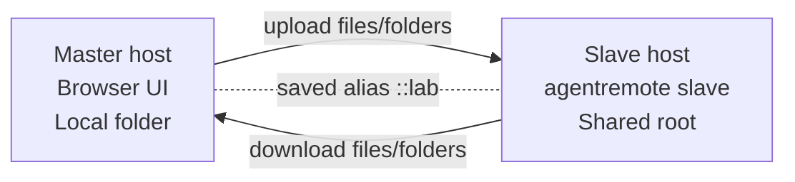
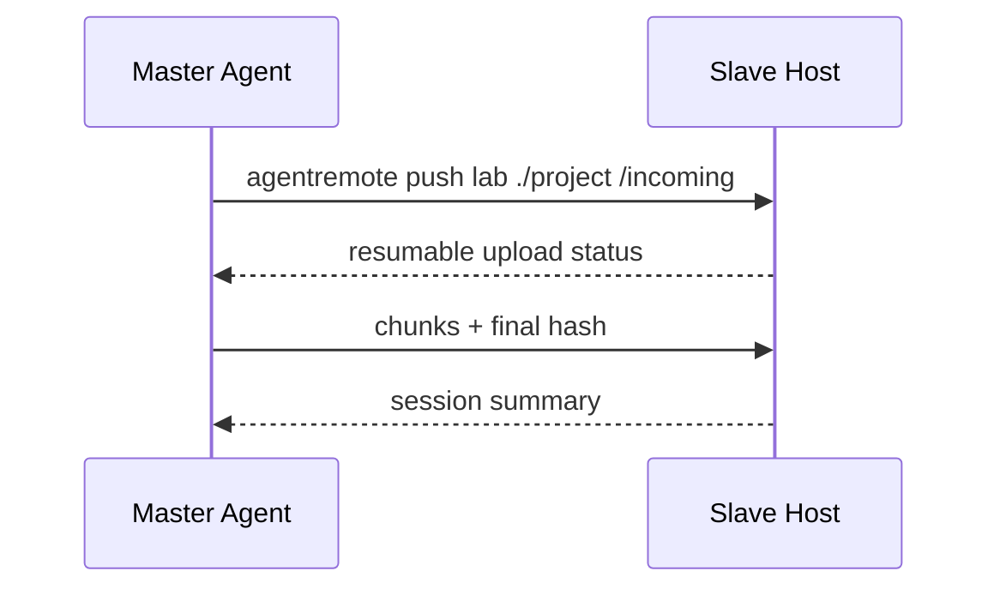
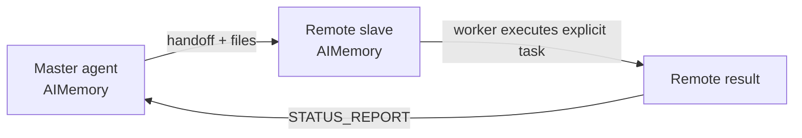
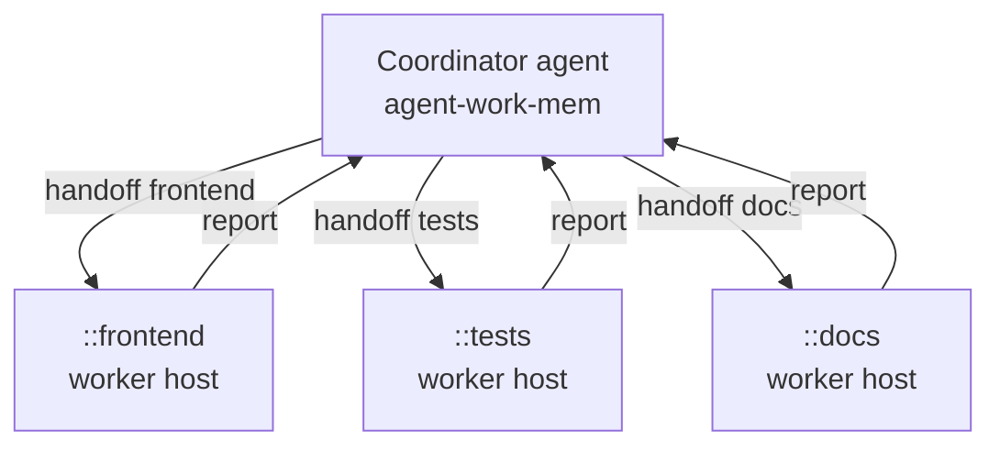

# agent-remote-sync

> Cross-host file/folder transfer and remote-agent handoff for agent swarm workflows.
> The `agentremote` CLI, Python import path, and distribution package name are the v0.1 interface.

[English](README.md) | [한국어](README.ko.md)

[](https://github.com/daystar7777/agent-remote-sync/actions/workflows/ci.yml)

Easy cross-host file/folder transfer and remote-agent handoff for building agent swarm workflows.

agent-remote-sync lets one machine expose a project folder as a **slave**, while another
machine connects as a **master** through a browser UI or headless CLI. It is
designed for agent workflows: move project folders, send task intent, receive
status reports, and keep local/remote handoff history through
[`agent-work-mem`](https://github.com/daystar7777/agent-work-mem).

In that sense, agent-remote-sync is a network extension for agent-work-mem: it carries
agent memory, handoff intent, and status reports beyond one local machine and
into trusted remote hosts.

agent-remote-sync is not the FTP protocol. It uses a small HTTP/HTTPS API built for
root-confined browsing, resumable large-file transfer, sync planning, and
agent-to-agent handoff.

## Why agent-remote-sync?

- **Easy setup**: install from GitHub, bootstrap prerequisites, then run slave or master mode.
- **Powerful file transfer**: browser UI, headless push/pull, folder sync, resumable large files, cancel/resume, conflict checks, and disk-space preflight.
- **Remote agent handoff**: send instructions with files, receive reports, and let a remote worker process explicit `agentremote-run:` tasks.
- **Swarm-ready foundation**: saved host aliases, host history, scoped tokens, worker daemon mode, and local/remote AIMemory records powered by agent-work-mem.
- **Cross-platform**: Windows, macOS, and Linux with Unicode filename normalization for Korean/accented filenames.

## Two Operating Modes

agent-remote-sync is useful both when a human wants to move files directly and when an
agent should handle transfer or handoff without a GUI.

For agent workflows, start `agentremote slave`, `agentremote master`, and `agentremote
worker` from the agent session that owns the project folder. Running the same
commands in a plain terminal still works for file transfer, but agent-paired
handoffs are clearest when the local agent starts agent-remote-sync inside its own
project root and AIMemory context.

### GUI Mode: User-Driven Transfer

- Start the receiver as a console slave with `agentremote slave`.
- Open the browser-based master UI with `agentremote master lab`.
- The master browser opens automatically and shows remote files on the left,
  local files on the right.
- On Windows, if `slave` or `master` is launched by an agent without an
  interactive terminal, agent-remote-sync opens a visible console window by default so it
  can be inspected and stopped later.
- Use `agentremote master lab --no-browser` when you only want the local UI URL.
  Use `--console no` only when you intentionally want to keep the process in the
  current non-interactive session.

GUI mode is best when a user wants to inspect folders, select files manually,
upload/download in either direction, and confirm conflicts visually.

### Headless Mode: Agent-Driven Transfer And Handoff

- Transfer files with `agentremote push`, `agentremote pull`, and `agentremote sync`.
- Send remote instructions with `agentremote tell` or files plus instructions with
  `agentremote handoff`.
- Let a receiving agent process eligible work with `agentremote worker`.
- Send structured results back with `agentremote report`.

Headless mode is the automation path: an agent can move a project folder, hand
off task intent, wait for remote work, and receive a report without opening the
browser UI.

**Important:** the slave itself is a console process. If the remote worker or
the agent runtime is started in an approval/permission prompt mode, execution
can pause on the slave host until someone approves it locally. For unattended
handoffs, use a pre-approved worker policy only with trusted hosts, explicit
`agentremote-run:` commands, scoped tokens, and a narrow project root.

See [docs/agent-pairing.md](docs/agent-pairing.md) for the expected first-run
prompts and an agent-friendly launch flow.

### Swarm Vocabulary Preview

The current `slave` and `master` commands remain supported. A Phase 0 swarm
CLI scaffold also exposes the same ideas with future-facing names:

```powershell
agentremote daemon serve        # compatibility alias for slave mode
agentremote controller gui lab  # compatibility alias for master browser UI
agentremote daemon status
agentremote nodes list
agentremote topology show
agentremote policy list
agentremote policy allow lab --note "trusted worker"
agentremote policy allow-tailscale  # allow Tailscale IPv4/IPv6 ranges
agentremote route set lab 100.64.1.20 7171 --priority 10
agentremote route list
```

Policy and route data are local controller-side metadata stored without
secrets. Saved connection aliases become direct remote nodes, explicit routes
can be ranked by priority, and whitelist enforcement is available through
`--policy warn|strict|off`. `policy allow-tailscale` registers Tailscale's
default IPv4 and IPv6 tailnet ranges as CIDR whitelist entries; authentication
is still required. Multi-hop routing and richer latency-based route selection
remain future phases.

## Status

agent-remote-sync is an early `v0.1` prototype. The core transfer and handoff flows are
implemented and covered by scenario tests, but the project is still evolving.
Use a trusted network or HTTPS, and review the security notes before using it
with sensitive project data.

The v1 direction is tracked in [docs/development-plan.md](docs/development-plan.md).

## Required: agent-work-mem

agent-remote-sync requires [`agent-work-mem`](https://github.com/daystar7777/agent-work-mem)
in each project root before runtime commands can operate.

agent-work-mem gives agents a local working memory through `AIMemory/`. agent-remote-sync
extends that memory model across hosts: outgoing handoffs are recorded locally,
incoming handoffs are recorded remotely, and reports can travel back as
structured memory instead of disappearing into a chat transcript.

`agentremote bootstrap` checks for agent-work-mem. If it is missing, agent-remote-sync asks
whether to install/setup it first. If you decline, agent-remote-sync intentionally stops
instead of running without memory and handoff records.

## Install

```powershell
pipx install git+https://github.com/daystar7777/agent-remote-sync.git
agentremote setup
```

`setup` is the friendly alias for `bootstrap`. It checks Python, pip, Git, pipx, GitHub reachability, and
agent-work-mem AIMemory. If agent-work-mem is missing, agent-remote-sync asks before
installing it. If you decline, runtime setup fails intentionally.

For local development:

```powershell
git clone https://github.com/daystar7777/agent-remote-sync.git
cd agent-remote-sync
python -m pip install -e .
agentremote doctor
```

## Quick Start

The easy command surface is meant for humans and agents. Use these first:

```powershell
agentremote setup
agentremote share
agentremote connect lab 100.64.1.20
agentremote open lab
agentremote send lab ./KKK
agentremote sync-project lab
agentremote ask lab "Run tests and report back" --wait-report
agentremote handoff lab ./LLL "Review this and report back"
agentremote map
agentremote status
agentremote uninstall
```

### Daily Use

After the first setup, the normal loop should stay short:

```powershell
agentremote share --host 0.0.0.0
agentremote daemon profile save --root . --name current-project --host 0.0.0.0 --port 7171
agentremote connect lab 100.64.1.20
agentremote open lab
agentremote sync-project lab --yes
agentremote ask lab "Run tests and report back" --wait-report
agentremote map
agentremote status
```

Use the browser dashboard when you want one screen for nodes, saved daemon
profiles, local processes, recent calls, and pending approvals.

On the receiving machine, ask the local agent to share the folder from the
project root:

```powershell
cd my-project
agentremote setup
agentremote share
```

The first run may ask to install agent-work-mem, set a pairing password, and
decide whether to open the firewall. These are normal pairing/setup checks, not
an error. `agentremote share` binds to `127.0.0.1` by default so local testing is
safe. For a trusted LAN/Tailscale share, run:

```powershell
agentremote share --host 0.0.0.0
```

If the command was launched by an agent on Windows, agent-remote-sync should open a
visible console window automatically. The share then prints only addresses that
match its bind mode. The default port is `7171`, and the current folder becomes
the root. A controller cannot browse outside it.

On the sending machine, ask the local agent to save the connection and open the
browser master UI:

```powershell
cd my-project
agentremote setup
agentremote connect lab 100.64.1.20
agentremote open lab
```

The browser opens automatically. The left panel shows the remote slave folder;
the right panel shows your local folder. Select files or folders and transfer
them in either direction.

The advanced compatibility commands are still available: `agentremote slave`,
`agentremote master`, `agentremote push`, `agentremote pull`, `agentremote sync`, and
`agentremote topology`.

### Map And Status

Use `agentremote map` when you want a quick topology view before sending a command.
It lists known nodes, the selected route, latest call state, pending approvals,
and explicit whitelist status.

```powershell
agentremote map
```

Use `agentremote status` when you want a local health summary for the current
project: AIMemory setup, saved connections, node status counts, local
master/slave/worker processes, call results, and pending approvals.

```powershell
agentremote status
```

The browser dashboard shows the same shape of information with node cards,
process controls, recent calls, and approval cards. It intentionally shows
approval summaries only; approval details, token hashes, and saved connection
tokens are not exposed through the dashboard payload.

### Daemon Profiles

For repeated use, save a daemon profile for each project. A profile records only
the project root, bind host, port, and display name. It does not store the
pairing password.

```powershell
agentremote daemon profile save --root . --name current-project --host 127.0.0.1 --port 7171
agentremote daemon profile list --root .
agentremote daemon status --root .
agentremote daemon install --root .
agentremote daemon uninstall --root .
```

`install` and `uninstall` are dry-run planners in v0.1. They render the
Windows Task Scheduler, macOS LaunchAgent, or Linux `systemd --user` shape
without changing the OS. Generated service commands use
`--password-env AGENTREMOTE_DAEMON_PASSWORD` so secrets stay out of profile files
and command lines.

### Safe Uninstall

Removal is intentionally explicit. Start with a dry-run:

```powershell
agentremote uninstall --root . --project-state
agentremote daemon profile list --root .
agentremote daemon profile remove --root . --name current-project
agentremote daemon uninstall --root .
```

`agentremote uninstall` does not delete AIMemory by default. Keep AIMemory when you
want the project handoff/history trail; use `--purge-memory` only after
reviewing what will be removed.

### Known Limitations

- `agentremote daemon install` and `agentremote daemon uninstall` are dry-run planners
  in v0.1. They print OS service specs but do not create or remove services yet.
- Relay pairing and the paid mobile controller are future features. Use direct
  LAN/VPN/Tailscale routes or public HTTPS endpoints for now.
- Flood and DDoS handling is defensive but local: rate limits, panic shutdown,
  and whitelist checks reduce blast radius, but internet-facing deployments
  still need firewall, VPN, reverse proxy, or cloud edge protection.
- Worker policy `network`, `cwd`, and `env` fields are recorded as policy
  metadata in v0.1; command allow/deny and timeout enforcement are active.
- Swarm topology and route health are controller-side coordination data. A node
  that is offline or powered down is reflected as stale/offline after the local
  process registry and route probes age out.

### Project Sync Defaults

`agentremote sync-project lab` is plan-first. It writes a sync plan and prints the
files, bytes, conflicts, excludes, and remote free space when the remote reports
it. Nothing is transferred until you add `--yes`.

```powershell
agentremote sync-project lab
agentremote sync-project lab --yes
agentremote sync-project lab --local ./subproject /remote/subproject --yes
agentremote sync-project lab --include-memory
agentremote sync-project lab --exclude "*.log"
```

Project sync excludes generated and local-state folders by default: `.git/`,
`.venv/`, `venv/`, `node_modules/`, `__pycache__/`, `.pytest_cache/`,
`.mypy_cache/`, `.ruff_cache/`, `dist/`, `build/`, `.agentremote/`,
`.agentremote_partial/`, `.agentremote_handoff/`, `.agentremote_inbox/`, and
`AIMemory/`. Use `--include-memory` only when you intentionally want to sync
agent-work-mem state.

## Usage Examples

### 1. Browser-Based File/Folder Transfer

Use this when a human wants to browse both sides and move files visually.



```powershell
# Slave host
cd project-to-share
agentremote bootstrap
agentremote slave

# Master host
cd my-project
agentremote bootstrap
agentremote connect lab 100.64.1.20
agentremote master lab
```

### 2. Headless Project Push Or Pull

Use this when an agent or script should transfer a folder without opening the UI.



```powershell
agentremote push lab ./project /incoming
agentremote pull lab /result ./received
```

### 3. Remote Agent Handoff With Report

Use this when the remote side should receive files, understand the task, and
send back a structured report.



```powershell
# Send project plus intent
agentremote handoff lab ./project "Review this project and report the test result." --expect-report "Summary and next steps"

# On the remote host
agentremote worker --execute ask

# Or send a manual report
agentremote report master <handoff-id> "Tests passed. Suggested next step: release."
```

### 4. Agent Swarm Foundation

Use this pattern when one coordinator wants to hand off different folders or
tasks to multiple trusted hosts.



```powershell
agentremote connect frontend 100.64.1.21
agentremote connect tests 100.64.1.22
agentremote connect docs 100.64.1.23

agentremote handoff frontend ./web "Review UI changes and report risks." --expect-report "Findings"
agentremote handoff tests ./project "Run the test suite and report failures." --expect-report "Test result"
agentremote tell docs "Review README and suggest clearer examples." --expect-report "Doc suggestions"
```

## HTTPS

For safer cross-host use, start the slave with a self-signed certificate:

```powershell
agentremote slave --tls self-signed
```

The slave prints an HTTPS URL and SHA-256 fingerprint. Pin that fingerprint when
connecting:

```powershell
agentremote connect lab https://100.64.1.20:7171 --tls-fingerprint <sha256-fingerprint>
```

Saved aliases remember the fingerprint for later `master`, `push`, `pull`,
`sync`, `tell`, `handoff`, and `report` commands.

## Headless File Transfer

Upload a file or folder:

```powershell
agentremote push lab ./project /incoming
```

Download from the remote host:

```powershell
agentremote pull lab /result ./received
```

Plan or apply conservative folder sync:

```powershell
agentremote sync plan lab ./project /project
agentremote sync push lab ./project /project --compare-hash
agentremote sync pull lab /project ./project
```

Sync copies missing files and treats changed target files as conflicts unless
you confirm or pass `--overwrite`. Extra target files are reported as delete
candidates and are removed only when `--delete` is explicitly supplied.

## Remote Agent Handoff

Send files and a task together:

```powershell
agentremote handoff lab ./project "Review this project and report the test result." --expect-report "Summary and next steps"
```

Send only an instruction:

```powershell
agentremote ask lab "Review /incoming/project and report back." --path /incoming/project --wait-report
agentremote tell lab "Review /incoming/project and report back." --path /incoming/project
```

`ask` is the friendly instruction-only command. It requests a report by default
and can wait for a matching `STATUS_REPORT` with `--wait-report --timeout 600`.
For file-plus-instruction handoffs, both forms are supported:

```powershell
agentremote handoff lab ./project "Review this project and report back."
agentremote handoff lab --path ./project --task "Review this project and report back." --wait-report
```

Receive and inspect remote work:

```powershell
agentremote inbox
agentremote inbox --read <instruction-id>
agentremote report lab <handoff-id> "Tests passed."
```

Run a receiving worker:

```powershell
agentremote worker --once
agentremote worker --execute ask
```

Worker mode only executes commands that are explicitly written as
`agentremote-run: <command>` lines, and only when `--execute ask` or
`--execute yes` is supplied. Without `--once`, the worker polls continuously for
eligible `autoRun` handoffs.

For execution, the receiver also needs a local worker command policy. Start with
a strict allowlist and keep it inside the project root:

```powershell
agentremote worker-policy init --root .
agentremote worker-policy allow python-tests python --args-pattern "*pytest*" --timeout 300 --max-stdout 20000 --root .
agentremote worker-policy templates --root .
agentremote worker-policy apply-template python-compile --root .
agentremote worker-policy list --root .
```

Commands that do not match a worker-policy rule are marked `blocked` and are not
run, even when the handoff is `autoRun` and the worker is started with
`--execute yes`. Worker policy rules run without the system shell by default;
use `--shell` only for commands that explicitly require shell builtins or shell
expansion.

In v0.1, worker-policy `network`, `cwdPattern`, and `envAllowlist` fields are
descriptive metadata only. They help document intent and prepare future
enforcement, but they do not sandbox commands or restrict network/filesystem/
environment access.

When using `--execute ask`, the approval prompt appears on the slave/worker
host, not on the master. This is safer for manual supervision, but it can make a
remote handoff wait indefinitely if nobody is watching that console.

## Saved Host Aliases

```powershell
agentremote connect lab 100.64.1.20
agentremote connections
agentremote disconnect lab
```

agent-remote-sync stores aliases with a `::` prefix internally, such as `::lab`, to avoid
confusing saved hosts with ordinary words. You can still type `lab` in commands.

Host activity is recorded in `AIMemory/agentremote_hosts/<name>.md`, while detailed
transfer logs stay under `.agentremote/`.

## Security Model

agent-remote-sync is built around conservative defaults:

- all file operations are confined to the selected root folder,
- delete is immediate and requires explicit user action,
- bearer tokens can be scoped with `read`, `write`, `delete`, and `handoff`,
- login attempts and requests are rate-limited,
- JSON bodies and transfer chunks have size limits,
- HTTPS supports self-signed and manually provided certificates,
- firewall opening is opt-in through `--firewall ask|yes|no`.

Example scoped connection:

```powershell
agentremote connect reviewer 100.64.1.20 --scopes read,handoff
```

Read the full security notes in [docs/security.md](docs/security.md).

## Approval Mode (v0.1)

agent-remote-sync supports project-level approval gates for sensitive operations:

```powershell
# View current policy
agentremote approvals policy --root .

# Set approval mode
agentremote approvals policy --root . --mode ask     # ask for risky actions
agentremote approvals policy --root . --mode strict   # ask for every write/delete
agentremote approvals policy --root . --mode deny     # deny all sensitive ops
agentremote approvals policy --root . --mode auto     # default, no approval needed
```

When approval is required, a request is created. The master dashboard shows
pending approvals with origin type/node, target node, risk level, and summary.
Approve/deny via CLI or dashboard:

```powershell
agentremote approvals list --root .
agentremote approvals approve <id> --root .
agentremote approvals deny <id> --root .
```

Gated actions include: worker command execution, process stop/forget, local/remote delete, policy changes.
Approval records live under `.agentremote/approvals` and are mirrored into
AIMemory without approval tokens or raw details that may contain secrets.

> **Note**: `ask`/`strict`/`deny` modes block headless/worker flows until another controller/CLI approves. Default is `auto` for compatibility.

## Transfer State

High-volume transfer details are kept out of AIMemory:

```text
.agentremote/
  logs/
  sessions/
  plans/
.agentremote_partial/
```

Transfers are resumable, logs rotate by size, and cancelled transfers leave
partial files in place for a later resume. Clean stale partials with:

```powershell
agentremote cleanup --older-than-hours 24
```

See [docs/transfer-state.md](docs/transfer-state.md).

## Documentation

- [Usage scenarios](docs/usage-scenarios.md)
- [Agent pairing](docs/agent-pairing.md)
- [Headless handoff](docs/headless-handoff.md)
- [Security](docs/security.md)
- [Protocol](docs/protocol.md)
- [Transfer state](docs/transfer-state.md)
- [Filename normalization](docs/filename-normalization.md)
- [Bootstrap](docs/bootstrap.md)

## Development

Run the test suite:

```powershell
$env:PYTHONPATH='src'
python -m compileall -q src tests deepseek-test
python -m unittest discover -s tests
python -m pytest tests deepseek-test -q
```

The current scenario suite covers install/bootstrap, slave/master transfer,
headless push/pull, handoff/report round trips, TLS, scoped tokens, sync,
storage preflight, cancellation, cleanup, and worker daemon behavior.

## Release Smoke Checklist (v0.1)

Before releasing, verify these manual steps:

```powershell
$env:PYTHONPATH='src'
python smoke.py
```

The smoke script runs a local-only daemon, connection, push, handoff, worker-policy, worker execution, and approval-policy check in a temporary directory. It does not require Tailscale or external network access.

```powershell
$env:PYTHONPATH='src'
New-Item -ItemType Directory -Force test-root | Out-Null

# 1. Bootstrap
python -m agentremote bootstrap --root ./test-root --install yes --no-network-check

# 2. Start daemon
python -m agentremote daemon serve --root ./test-root --password test --port 17171

# 3. Connect (from another terminal)
python -m agentremote connect lab 127.0.0.1 17171 --password test

# 4. Transfer
echo "hello" > test.txt
python -m agentremote push lab test.txt /incoming

# 5. Handoff
python -m agentremote handoff lab test.txt "Review test.txt and report"

# 6. Approval
python -m agentremote approvals policy --root . --mode ask
python -m agentremote approvals list --root .

# 7. Cleanup
python -m agentremote cleanup --root ./test-root
```

Stop the daemon terminal with `Ctrl+C` after the smoke pass.

## License

MIT
