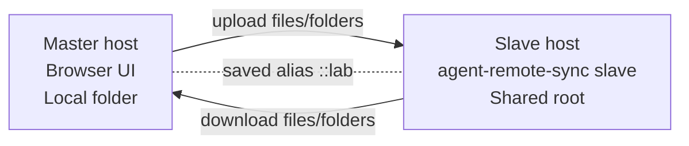
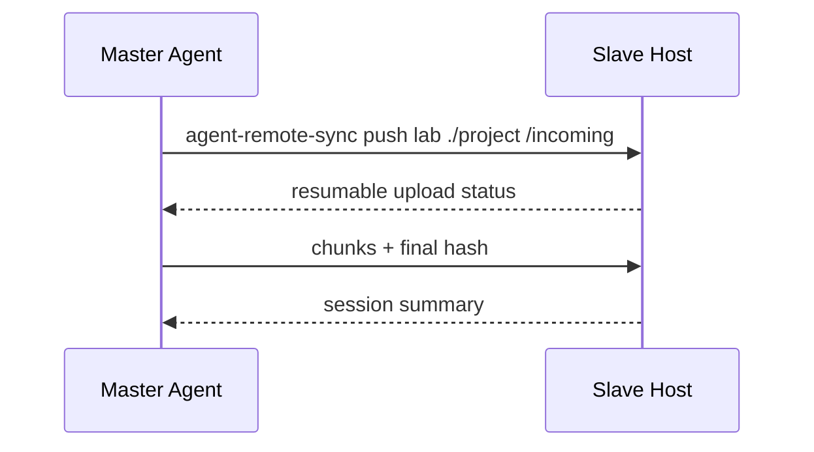
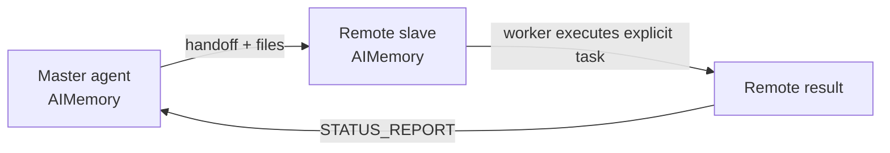
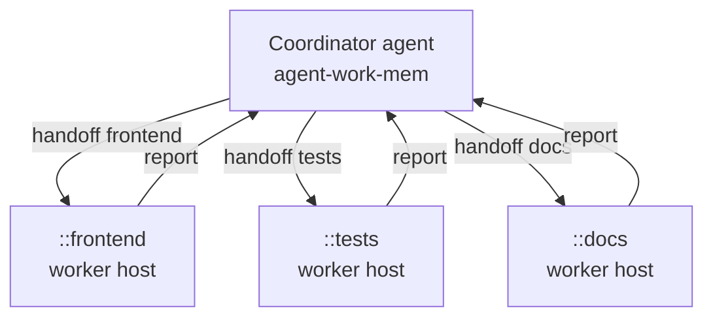

# agent-remote-sync

[English](README.md) | [한국어](README.ko.md)

[](https://github.com/daystar7777/agent-remote-sync/actions/workflows/ci.yml)

Easy cross-host file/folder transfer and remote-agent handoff for building agent swarm workflows.

agent-remote-sync lets one machine expose a project folder as a **slave**, while another
machine connects as a **master** through a browser UI or headless CLI. It is
designed for agent workflows: move project folders, send task intent, receive
status reports, and keep local/remote handoff history through
[`agent-work-mem`](https://github.com/daystar7777/agent-work-mem).

In that sense, agent-remote-sync is a network extension for agent-work-mem: it carries
agent memory, handoff intent, and status reports beyond one local machine and
into trusted remote hosts.

agent-remote-sync is not the FTP protocol. It uses a small HTTP/HTTPS API built for
root-confined browsing, resumable large-file transfer, sync planning, and
agent-to-agent handoff.

## Why agent-remote-sync?

- **Easy setup**: install from GitHub, bootstrap prerequisites, then run slave or master mode.
- **Powerful file transfer**: browser UI, headless push/pull, folder sync, resumable large files, cancel/resume, conflict checks, and disk-space preflight.
- **Remote agent handoff**: send instructions with files, receive reports, and let a remote worker process explicit `agent-remote-sync-run:` tasks.
- **Swarm-ready foundation**: saved host aliases, host history, scoped tokens, worker daemon mode, local/remote AIMemory records, and a localhost process dashboard powered by agent-work-mem.
- **Cross-platform**: Windows, macOS, and Linux with Unicode filename normalization for Korean/accented filenames.

## Two Operating Modes

agent-remote-sync is useful both when a human wants to move files directly and when an
agent should handle transfer or handoff without a GUI.

For agent workflows, start `agent-remote-sync slave`, `agent-remote-sync master`, and `agent-remote-sync
worker` from the agent session that owns the project folder. Running the same
commands in a plain terminal still works for file transfer, but agent-paired
handoffs are clearest when the local agent starts agent-remote-sync inside its own
project root and AIMemory context.

### GUI Mode: User-Driven Transfer

- Start the receiver as a console slave with `agent-remote-sync slave`.
- Open the browser-based master UI with `agent-remote-sync master lab`.
- The master browser opens automatically and shows remote files on the left,
  local files on the right.
- On Windows, if `slave` or `master` is launched by an agent without an
  interactive terminal, agent-remote-sync opens a visible console window by default so it
  can be inspected and stopped later.
- Use `agent-remote-sync master lab --no-browser` when you only want the local UI URL.
  Use `--console no` only when you intentionally want to keep the process in the
  current non-interactive session.

GUI mode is best when a user wants to inspect folders, select files manually,
upload/download in either direction, and confirm conflicts visually.

### Local Dashboard: Process And Channel Control

When multiple projects, masters, and slaves are running on one host, open the
local control panel:

```powershell
agent-remote-sync dashboard
```

The dashboard is bound to `127.0.0.1`. It shows running master/slave/dashboard
processes, saved channel aliases, remote host/port, project roots, recent
transfer sessions, recent handoffs, inbox items, transfer speed, and ETA. It can
also stop local agent-remote-sync processes after confirmation. Stopping a process can
interrupt an active transfer or handoff, so agents should ask the user before
clicking Stop or running `agent-remote-sync stop <instance-id> --yes`.

### Headless Mode: Agent-Driven Transfer And Handoff

- Transfer files with `agent-remote-sync push`, `agent-remote-sync pull`, and `agent-remote-sync sync`.
- Send remote instructions with `agent-remote-sync tell` or files plus instructions with
  `agent-remote-sync handoff`.
- Let a receiving agent process eligible work with `agent-remote-sync worker`.
- Send structured results back with `agent-remote-sync report`.

Headless mode is the automation path: an agent can move a project folder, hand
off task intent, wait for remote work, and receive a report without opening the
browser UI.

**Important:** the slave itself is a console process. If the remote worker or
the agent runtime is started in an approval/permission prompt mode, execution
can pause on the slave host until someone approves it locally. For unattended
handoffs, use a pre-approved worker policy only with trusted hosts, explicit
`agent-remote-sync-run:` commands, scoped tokens, and a narrow project root.

See [docs/agent-pairing.md](docs/agent-pairing.md) for the expected first-run
prompts and an agent-friendly launch flow.

## Status

agent-remote-sync is an early `v0.1` prototype. The core transfer and handoff flows are
implemented and covered by scenario tests, but the project is still evolving.
Use a trusted network or HTTPS, and review the security notes before using it
with sensitive project data.

The v1 direction is tracked in [docs/development-plan.md](docs/development-plan.md).

## Required: agent-work-mem

agent-remote-sync requires [`agent-work-mem`](https://github.com/daystar7777/agent-work-mem)
in each project root before runtime commands can operate.

agent-work-mem gives agents a local working memory through `AIMemory/`. agent-remote-sync
extends that memory model across hosts: outgoing handoffs are recorded locally,
incoming handoffs are recorded remotely, and reports can travel back as
structured memory instead of disappearing into a chat transcript.

`agent-remote-sync bootstrap` checks for agent-work-mem. If it is missing, agent-remote-sync asks
whether to install/setup it first. If you decline, agent-remote-sync intentionally stops
instead of running without memory and handoff records.

## Install

```powershell
pipx install git+https://github.com/daystar7777/agent-remote-sync.git
agent-remote-sync bootstrap
```

`bootstrap` checks Python, pip, Git, pipx, GitHub reachability, and
agent-work-mem AIMemory. If agent-work-mem is missing, agent-remote-sync asks before
installing it. If you decline, runtime setup fails intentionally.

For local development:

```powershell
git clone https://github.com/daystar7777/agent-remote-sync.git
cd agent-remote-sync
python -m pip install -e .
agent-remote-sync doctor
```

## Quick Start

On the receiving machine, ask the local agent to run slave mode from the folder
you want to share:

```powershell
cd my-project
agent-remote-sync bootstrap
agent-remote-sync slave
```

The first run may ask to install agent-work-mem, set a pairing password, and
decide whether to open the firewall. These are normal pairing/setup checks, not
an error. If the command was launched by an agent on Windows, agent-remote-sync should
open a visible console window automatically. The slave then prints its
local/LAN/Tailscale addresses. The default port is `7171`, and the current
folder becomes the root. A master cannot browse outside it.

On the sending machine, ask the local agent to save the connection and open the
browser master UI:

```powershell
cd my-project
agent-remote-sync bootstrap
agent-remote-sync connect lab 100.64.1.20
agent-remote-sync master lab
```

The browser opens automatically. The left panel shows the remote slave folder;
the right panel shows your local folder. Select files or folders and transfer
them in either direction.

## Usage Examples

### 1. Browser-Based File/Folder Transfer

Use this when a human wants to browse both sides and move files visually.



```powershell
# Slave host
cd project-to-share
agent-remote-sync bootstrap
agent-remote-sync slave

# Master host
cd my-project
agent-remote-sync bootstrap
agent-remote-sync connect lab 100.64.1.20
agent-remote-sync master lab
```

### 2. Headless Project Push Or Pull

Use this when an agent or script should transfer a folder without opening the UI.



```powershell
agent-remote-sync push lab ./project /incoming
agent-remote-sync pull lab /result ./received
```

### 3. Remote Agent Handoff With Report

Use this when the remote side should receive files, understand the task, and
send back a structured report.



```powershell
# Send project plus intent
agent-remote-sync handoff lab ./project "Review this project and report the test result." --expect-report "Summary and next steps"

# On the remote host
agent-remote-sync worker --execute ask

# Or send a manual report
agent-remote-sync report master <handoff-id> "Tests passed. Suggested next step: release."
```

### 4. Agent Swarm Foundation

Use this pattern when one coordinator wants to hand off different folders or
tasks to multiple trusted hosts.



```powershell
agent-remote-sync connect frontend 100.64.1.21
agent-remote-sync connect tests 100.64.1.22
agent-remote-sync connect docs 100.64.1.23

agent-remote-sync handoff frontend ./web "Review UI changes and report risks." --expect-report "Findings"
agent-remote-sync handoff tests ./project "Run the test suite and report failures." --expect-report "Test result"
agent-remote-sync tell docs "Review README and suggest clearer examples." --expect-report "Doc suggestions"
```

## HTTPS

For safer cross-host use, start the slave with a self-signed certificate:

```powershell
agent-remote-sync slave --tls self-signed
```

The slave prints an HTTPS URL and SHA-256 fingerprint. Pin that fingerprint when
connecting:

```powershell
agent-remote-sync connect lab https://100.64.1.20:7171 --tls-fingerprint <sha256-fingerprint>
```

Saved aliases remember the fingerprint for later `master`, `push`, `pull`,
`sync`, `tell`, `handoff`, and `report` commands.

## Headless File Transfer

Upload a file or folder:

```powershell
agent-remote-sync push lab ./project /incoming
```

Download from the remote host:

```powershell
agent-remote-sync pull lab /result ./received
```

Plan or apply conservative folder sync:

```powershell
agent-remote-sync sync plan lab ./project /project
agent-remote-sync sync push lab ./project /project --compare-hash
agent-remote-sync sync pull lab /project ./project
```

Sync copies missing files and treats changed target files as conflicts unless
you confirm or pass `--overwrite`. Extra target files are reported as delete
candidates and are removed only when `--delete` is explicitly supplied.

## Remote Agent Handoff

Send files and a task together:

```powershell
agent-remote-sync handoff lab ./project "Review this project and report the test result." --expect-report "Summary and next steps"
```

Send only an instruction:

```powershell
agent-remote-sync tell lab "Review /incoming/project and report back." --path /incoming/project
```

Receive and inspect remote work:

```powershell
agent-remote-sync inbox
agent-remote-sync inbox --read <instruction-id>
agent-remote-sync report lab <handoff-id> "Tests passed."
```

Run a receiving worker:

```powershell
agent-remote-sync worker --once
agent-remote-sync worker --execute ask
```

Worker mode only executes commands that are explicitly written as
`agent-remote-sync-run: <command>` lines, and only when `--execute ask` or
`--execute yes` is supplied. Without `--once`, the worker polls continuously for
eligible `autoRun` handoffs.

When using `--execute ask`, the approval prompt appears on the slave/worker
host, not on the master. This is safer for manual supervision, but it can make a
remote handoff wait indefinitely if nobody is watching that console.

## Saved Host Aliases

```powershell
agent-remote-sync connect lab 100.64.1.20
agent-remote-sync connections
agent-remote-sync disconnect lab
```

agent-remote-sync stores aliases with a `::` prefix internally, such as `::lab`, to avoid
confusing saved hosts with ordinary words. You can still type `lab` in commands.

Host activity is recorded in `AIMemory/agent_remote_sync_hosts/<name>.md`, while detailed
transfer logs stay under `.agent_remote_sync/`.

## Security Model

agent-remote-sync is built around conservative defaults:

- all file operations are confined to the selected root folder,
- delete is immediate and requires explicit user action,
- bearer tokens can be scoped with `read`, `write`, `delete`, and `handoff`,
- login attempts and requests are rate-limited,
- JSON bodies and transfer chunks have size limits,
- HTTPS supports self-signed and manually provided certificates,
- firewall opening is opt-in through `--firewall ask|yes|no`.

Example scoped connection:

```powershell
agent-remote-sync connect reviewer 100.64.1.20 --scopes read,handoff
```

Read the full security notes in [docs/security.md](docs/security.md).

## Transfer State

High-volume transfer details are kept out of AIMemory:

```text
.agent_remote_sync/
  logs/
  sessions/
  plans/
.agent_remote_sync_partial/
```

Transfers are resumable, logs rotate by size, and cancelled transfers leave
partial files in place for a later resume. Clean stale partials with:

```powershell
agent-remote-sync cleanup --older-than-hours 24
```

See [docs/transfer-state.md](docs/transfer-state.md).

## Documentation

- [Usage scenarios](docs/usage-scenarios.md)
- [Agent pairing](docs/agent-pairing.md)
- [Headless handoff](docs/headless-handoff.md)
- [Security](docs/security.md)
- [Protocol](docs/protocol.md)
- [Transfer state](docs/transfer-state.md)
- [Filename normalization](docs/filename-normalization.md)
- [Bootstrap](docs/bootstrap.md)

## Development

Run the test suite:

```powershell
$env:PYTHONPATH='src'
python -m unittest discover -s tests
```

The current scenario suite covers install/bootstrap, slave/master transfer,
headless push/pull, handoff/report round trips, TLS, scoped tokens, sync,
storage preflight, cancellation, cleanup, and worker daemon behavior.

## License

MIT
