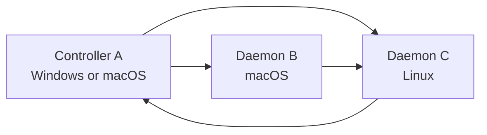

# v0.1 True Full-Scale Test Scenarios

This document is the no-shortcuts validation matrix for agent-remote-sync /
`agentremote`. It is stricter than the daily scenario suite and should be used as
the final release gate before a public v0.1 tag.

Use this together with:

- [`docs/v0.1-fullscale-test-scenarios.md`](v0.1-fullscale-test-scenarios.md)
- [`docs/v0.1-fullscale-lab-runbook.md`](v0.1-fullscale-lab-runbook.md)
- [`docs/docker-fullscale-lab.md`](docker-fullscale-lab.md)

## Principle

Docker can prove repeatable Linux multi-node protocol behavior. It cannot prove
native Windows/macOS filesystem behavior, APFS normalization behavior, Windows
console behavior, firewall prompts, or real service-manager behavior.

So the true full-scale gate has four layers:

| Layer | Environment | Purpose | Release Meaning |
|-------|-------------|---------|-----------------|
| T0 | Local automated tests | Fast correctness baseline | Required |
| T1 | Docker Compose lab | Repeatable multi-node Linux validation | Required when Docker is available |
| T2 | VM or emulator lab | Cross-platform rehearsal where native machines are scarce | Recommended |
| T3 | Real machines over LAN/Tailscale | Actual cross-host user behavior | Required for stable |

If T1/T2/T3 cannot run, mark the scenario `BLOCKED` with the exact environment
gap. Do not convert a blocked scenario into `PASS`.

## Evidence Contract

Every full-scale run must write:

```text
AIMemory/test-results_YYYYMMDD-HHMMSS-true-fullscale-deepseek.md
```

Attach or reference:

- OS, Python, browser, Docker, and network inventory.
- Exact commands and selected CLI output.
- Docker or VM artifact paths.
- GUI/dashboard screenshots when browser scenarios run.
- SHA-256 hashes for transferred large files.
- Topology/map output before and after route changes.
- Approval, handoff, worker, and call/report records.
- Logs proving no password/token leakage.
- `PASS`, `FAIL`, `BLOCKED`, or `NOT_RUN` per scenario.

## Data Sets

Generate disposable data:

```powershell
python tools\generate_fullscale_lab_data.py --root <lab-data> --many-count 5000 --large-size-mib 1024
```

Use smaller rehearsal data first:

```powershell
python tools\generate_fullscale_lab_data.py --root <lab-data> --many-count 50 --large-size-mib 1
```

Required datasets:

- `DS-small`: ordinary file/folder transfer.
- `DS-unicode`: Korean/Japanese/accent/NFC/NFD filename transfer.
- `DS-empty`: empty files and directories.
- `DS-conflict`: same path with different content.
- `DS-many`: thousands of files.
- `DS-large`: resumable large-file transfer.
- `DS-project`: source tree with `.git`, virtualenv, `node_modules`,
  `.agentremote`, `AIMemory`, source files, tests, logs, and generated files.

## T0: Automated Baseline

Run on the current source tree:

```powershell
python -m compileall -q src tests deepseek-test smoke.py tools
python -m unittest discover -s tests
python -m pytest tests deepseek-test -q
python smoke.py
git diff --check
python -m pip wheel . -w build/wheel-check --no-deps
```

Pass criteria:

- No compile errors.
- All unit/scenario tests pass.
- Smoke test passes.
- Whitespace check has no real errors. Windows CRLF warnings are acceptable only
  when `git diff --check` exits successfully.
- Wheel builds and includes `agentremote/web/index.html` and `py.typed`.

## T1: Docker Compose Multi-Node Lab

Run on a host with Docker Compose:

```powershell
python tools\run_docker_fullscale.py --fresh --many-count 50 --large-size-mib 1 --down-volumes
python tools\run_docker_fullscale.py --many-count 50 --large-size-mib 1 --down
python tools\run_docker_fullscale.py --many-count 500 --large-size-mib 16 --down
```

Stable soak when disk/time allows:

```powershell
python tools\run_docker_fullscale.py --fresh --many-count 5000 --large-size-mib 1024 --down-volumes
```

Pass criteria:

- `node-a`, `node-b`, and `controller` start cleanly.
- Connect succeeds for both nodes.
- Wrong password is rejected.
- Scoped read/handoff token cannot upload.
- Send, pull, sync-project, tell, handoff, route, and map pass.
- Unicode transfer passes inside Linux containers.
- Unicode pullback is verified against `unicode-manifest.json`; every expected
  normalized filename must exist and representative SHA-256 hashes must match.
- Many-file and large-file rehearsals pass or large-file is explicitly
  `BLOCKED` due disk constraints.
- Mirror mode is proven separately: create a stale remote file, run
  `sync-project --delete`, and verify the stale remote file can no longer be
  pulled.
- Re-running with kept named volumes does not fail on stale partials; corrupt or
  mismatched partial uploads are discarded and retried once at file scope.
- Authenticated bulk transfer traffic does not trip the normal controller API
  rate limit, while wrong-password and scoped-token protections still fire.
- A clean-volume run and a persistent-volume rerun both write reports under
  `build/docker-fullscale-results/`.

If Docker is unavailable, the wrapper should write a `BLOCKED` report under
`build/docker-fullscale-results/`. That is valid evidence of the blocker, not a
release pass.

## T2: VM / Emulator Cross-Platform Rehearsal

Use VMs when real machines are not ready:

| Pair | Minimum Goal |
|------|--------------|
| Windows VM -> Linux VM | path rules, firewall prompt, service profile |
| Linux VM -> Windows VM | case collisions, denied writes, long paths |
| macOS host/VM -> Windows or Linux | APFS/NFD filename behavior |

Pass criteria:

- Each pair can `share`, `connect`, `send`, `pull`, `sync-project`, `tell`, and
  `ask --wait-report`.
- Filename normalization is readable and does not silently overwrite files.
- Permission/storage errors are structured and recorded.
- Service/daemon planner output is correct for the target OS.

Note: Docker Linux containers are not a substitute for Windows/macOS VM or real
filesystem checks.

## T3: Real Cross-Host LAN/Tailscale Lab

Preferred topology:



Network modes:

- LAN or VM host-only route.
- Tailscale route.
- HTTPS/TLS pinned fingerprint for at least one pair.

Pass criteria:

- Host aliases use `::` consistently and are understandable in status/map.
- Whitelist rules are enforced.
- Tailscale allow helper can add/remove Tailscale CIDR ranges without storing
  secrets.
- Route priority wins over latency; fallback route is selected when primary is
  stale/offline.
- Dashboard topology reflects online/offline/active handoff state.

## T4: Browser GUI and Dashboard

Run the GUI against at least one real or Docker-backed node.

Required manual/browser checks:

- Remote pane left, local pane right.
- Upload/download controls stay visible with long folder lists.
- Upload file with no remote row selected.
- Upload folder.
- Download file with no local row selected.
- Download folder.
- Multi-select transfer.
- New folder, rename, move, delete, and root-delete rejection.
- Transfer monitor shows queued/current/done/error/cancel.
- Speed, transferred bytes, remaining bytes, and ETA are visible during active
  transfer.
- Canceling one queued/current transfer does not corrupt other jobs.
- Free-space is visible for both local and remote roots.
- Preflight blocks transfer when destination free space is known insufficient.
- Dashboard shows nodes, processes, daemon profiles, routes, handoffs, calls,
  approvals, worker policy, recent transfer history, and latest reports.
- Dashboard can stop/forget safe process/profile entries.
- DOM/API payloads do not expose password, bearer token, token hash, or command
  fingerprint.

Evidence:

- Screenshot of main file UI.
- Screenshot of transfer monitor during active transfer.
- Screenshot of dashboard overview.
- Screenshot or JSON snippet of a detail view with secrets redacted.

## T5: Security and Fault Injection

Run deterministic probes only. Do not perform real destructive or DDoS tests.

Required cases:

- Wrong password rejected.
- Repeated bad login returns rate-limit/blocked status.
- Path traversal rejected: `..`, absolute path, encoded traversal, mixed
  separators.
- Reserved state dirs hidden/protected: `.agentremote`, `.agentremote_partial`,
  `.agentremote_inbox`, AIMemory internals where applicable.
- Scoped token denial for write/delete.
- Whitelist deny.
- TLS pinned fingerprint success/failure.
- Oversized JSON/chunk rejected before large memory allocation.
- Permission denied write reports structured error.
- Insufficient remote/local storage preflight blocks safely.
- Logs/AIMemory/dashboard contain no password/token material.

Pass criteria:

- Any unsafe bypass is P0.
- Any daemon crash during these probes is P1 unless caused by explicitly
  unsupported environment setup.

## T6: Project Sync

Required cases:

- Plan-first default: no transfer without `--yes`.
- Default excludes: `.git`, `.venv`, `node_modules`, `.agentremote`, AIMemory, logs.
- `--include-memory` includes AIMemory only when explicit.
- Conflict blocks by default.
- `--overwrite` resolves conflict.
- `--delete` mirrors stale remote files only when explicit.
- `--compare-hash` avoids same-content mtime-only conflicts.
- Empty dirs are preserved.
- Missing source/remote reports `not_found`.
- Repeat sync is mostly skipped and logs stay compact.

Pass criteria:

- No accidental deletion without explicit `--delete`.
- Plan summary is understandable enough for an agent/user to decide.

## T7: Handoff, Worker, Approval, Call/Return

Required cases:

- `tell` instruction-only handoff.
- `handoff --path ... --task ...` file/folder plus task.
- `ask --wait-report` call/report loop.
- Remote worker dry-run.
- Remote worker allowed command execution.
- Remote worker blocked command.
- Worker timeout.
- Worker stdout cap.
- Approval modes: `auto`, `ask`, `strict`, `deny`.
- Local and remote approval origins are distinguishable.
- Approval decision is delivered back to the waiting execution path.

Pass criteria:

- Local and remote AIMemory both record external handoff context.
- Call state transitions are visible: sent, running/claimed, reported, failed, or
  timeout.
- Automatic mode never executes commands outside the worker allowlist.

## T8: Transfer Stress, Resume, and Concurrency

Required cases:

- 1 GiB upload resume after sender/receiver stop.
- 1 GiB download resume after sender/receiver stop.
- Concurrent upload and download.
- Queue with many jobs, including folder creation job entries.
- Cancel queued job.
- Cancel current job.
- Resume or retry after process restart.
- Logs rotate and session summaries stay compact.
- No unbounded CPU/memory growth over a 30-minute worker/transfer loop.

Pass criteria:

- Final hashes match.
- Partial files are either resumed or clearly marked as cleanup candidates.
- Cancel affects only the selected job.
- UI/dashboard state does not drift from session logs.

## T9: Daemon, Reboot, and Lifecycle

Required cases:

- Multiple project daemons on one host, different roots/ports.
- Controller and daemon profiles saved/listed/removed.
- Process stop from dashboard.
- Offline/stale process detection after daemon stop.
- Service planner output for Windows Task Scheduler, macOS LaunchAgent, and
  Linux systemd user unit.
- Fresh terminal launch behavior: interactive daemon does not exit on stdin EOF.
- Uninstall dry-run.
- Uninstall removes agent-remote-sync state only when explicitly requested and
  preserves AIMemory by default.

Pass criteria:

- Profiles store no password/token.
- Reboot/service behavior is either proven or explicitly marked blocked with OS
  details.

## T10: Packaging, Docs, and User Journey

Required cases:

- Fresh install from wheel outside the source tree.
- GitHub install command works.
- Bootstrap detects Python/Git/agent-work-mem prerequisites.
- Agent-work-mem missing path prompts installation or fails clearly when denied.
- README and README.ko match current commands.
- Quick commands work from an agent prompt:
  - install
  - share/daemon start
  - connect
  - open GUI
  - send folder
  - sync project
  - ask/handoff/report
  - status/map
  - uninstall
- Future relay/mobile features are documented as future, not production-ready.

Pass criteria:

- A new user can follow docs without knowing internal architecture.
- No command in docs requires hidden state that the docs did not create.

## Exit Rules

Release can proceed only when:

- T0 passes.
- T1 passes or is explicitly blocked by missing Docker infrastructure.
- T3 has at least one real two-host transfer path for stable release.
- T4 GUI/dashboard has screenshot evidence.
- T5 has zero open P0/P1.
- T6/T7 daily user flows pass.
- T8 large/resume/many-file cases either pass or are marked RC limitations.
- T9 install/daemon/uninstall behavior is safe.
- T10 docs match implementation.

Any P0 blocks release. Any P1 blocks release unless the feature is removed from
release scope and documented as unavailable.

## DeepSeek Execution Order

1. Run T0.
2. Run T1 if Docker Compose is available. If blocked, preserve the blocked
   report.
3. Run as much of T2/T3 as the available host/network allows.
4. Run T4 browser/dashboard scenarios and capture screenshots.
5. Run T5/T6/T7 with small datasets.
6. Run T8 rehearsal sizes first, then stable soak sizes if disk/time allows.
7. Run T9/T10.
8. Write the final report and list all blocked environment gaps.

## Report Skeleton

```markdown
# True Full-Scale Validation Report

- Date:
- Executor:
- Repo commit / worktree summary:
- Hosts:
- Network:
- Docker:
- Browser:

## Summary

| Layer | PASS | FAIL | BLOCKED | NOT_RUN |
|-------|------|------|---------|---------|
| T0 | | | | |
| T1 | | | | |
| T2 | | | | |
| T3 | | | | |
| T4 | | | | |
| T5 | | | | |
| T6 | | | | |
| T7 | | | | |
| T8 | | | | |
| T9 | | | | |
| T10 | | | | |

## Issues

| Severity | Scenario | Finding | Repro | Evidence |
|----------|----------|---------|-------|----------|

## Blocked

| Scenario | Reason | Required Environment |
|----------|--------|----------------------|

## Evidence

- Commands:
- Screenshots:
- Docker artifacts:
- Hashes:
- Logs:
- AIMemory files:
```
